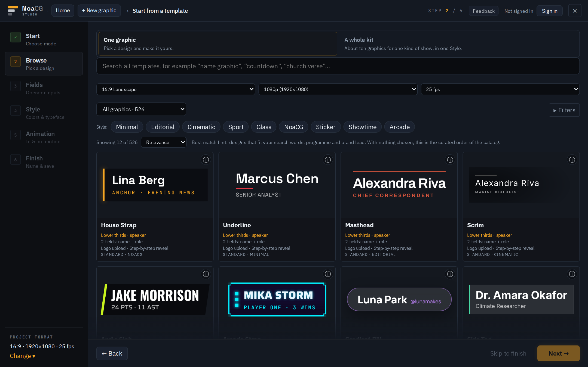
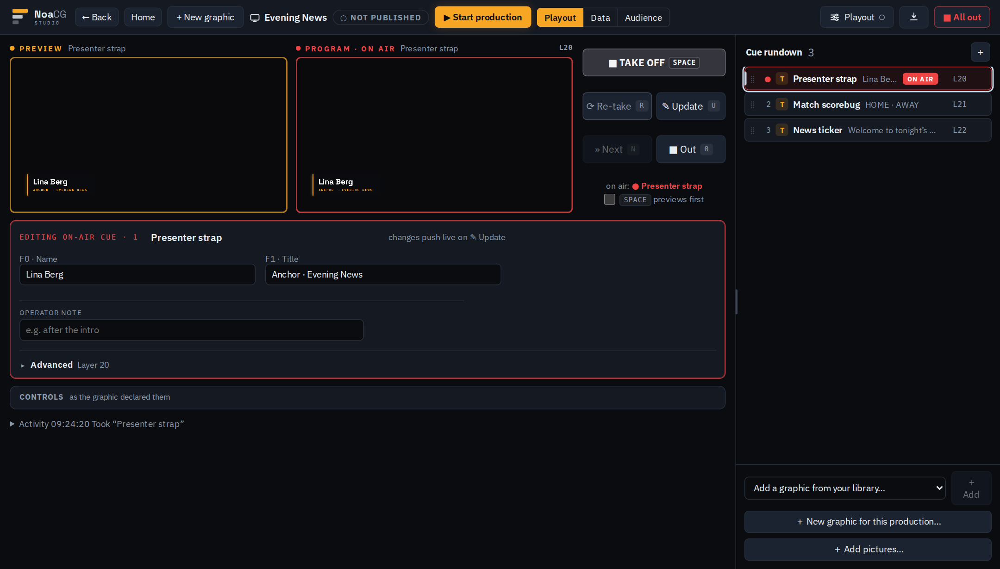

# NoaCG Studio

NoaCG Studio makes live broadcast graphics for shows and streams: lower thirds, scoreboards,
tickers, title cards and more. Make them from a template, from your own SVG, or with your AI
coding agent. Then play them from a browser source, run them through NoaCG Playout and NoaCG
Bridge to CasparCG, or export them as HTML templates.

It is free and open source, and it runs in your browser. You need no account to make and export
graphics. NoaCG is in beta.

**[noacg.studio](https://noacg.studio)** (the app) · **[Docs](https://noacg.studio/docs)** ·
**[Downloads](https://noacg.studio/downloads)** (NoaCG Bridge and the NoaCG CLI)

## 1. Make a graphic

- **From a template.** Pick a design from the library, one graphic or a whole kit, and set its
  text, colours, logo and motion.
- **From your own SVG.** Draw it in Illustrator or any tool that saves SVG, name the layers and
  keep text as text. Text layers become fields the operator edits. No AI is involved. PNG, JPEG,
  `.html` and `.zip` files import too. [Prepare your file](https://noacg.studio/docs#svg).
- **With your AI coding agent.** Ask Claude Code or Codex for a graphic "for NoaCG". The agent
  builds it, and the NoaCG CLI checks it in a live playout test and saves it to your library.
  Saving needs a free account. [Set up your agent](https://noacg.studio/docs#agent-install).



## 2. Play it or export it

NoaCG Playout is the operator page: a cue rundown, preview and program monitors, and Take, Update
and Out on the keyboard. You can change names and scores while a graphic is on air.

- **CasparCG with NoaCG Bridge.** NoaCG Bridge is a small Windows program on the playout machine.
  It connects NoaCG Playout to your CasparCG server and cues the server's clips from the same
  rundown. This is the main production setup.
- **OBS and browser sources.** Load a production's output URL as a browser source and the
  graphics play straight from NoaCG. Publishing an output URL needs a free account.
- **Export.** Download graphics as HTML templates for OGraf, CasparCG, SPX Graphics, H2R Graphics,
  LiveOS, OBS and vMix. They carry their own fonts and images and keep working without NoaCG. The
  vMix, SPX Graphics and LiveOS packages are not yet tested on those systems.



Every graphic also exports as an [EBU OGraf](https://ograf.ebu.io/) package, validated on
export. Playing OGraf packages made in other tools is not built yet. Also in beta: making a
graphic with AI in the browser, and a workspace for rendered video.

## Free and open source

Everything in the studio is free, and there is no paid edition. The source is open under
AGPL-3.0 and this repository is the whole product, so you can host it yourself. You need a free
account only for what the hosted service runs for you, such as publishing an output URL, saving
from the CLI or running AI.

## The NoaCG CLI and NoaCG Bridge

The NoaCG CLI and MCP server is published to npm as
[`@noacg/cli`](https://www.npmjs.com/package/@noacg/cli). It makes a graphic package (one folder
that is an EBU OGraf graphic and a SPX/CasparCG template), checks it against the same gate the
studio uses, takes screenshots, and saves it to your NoaCG library with a scoped agent key
(`noacg login`).

```bash
npx @noacg/cli scaffold --type scoreboard --design neutral --name "Football scoreboard" --out ./football-scoreboard
npx @noacg/cli validate ./football-scoreboard --screenshots ./shots
npx @noacg/cli save ./football-scoreboard
```

In Claude Code, the plugin adds the `noacg-graphic` skill and the `/noacg:graphic` command:

```bash
claude plugin marketplace add NoaCG/NoaCG-Studio
claude plugin install noacg@noacg-studio
```

Codex and the optional MCP plugin: [`cli/plugin/README.md`](cli/plugin/README.md) and
[`cli/plugin-mcp/README.md`](cli/plugin-mcp/README.md). The full account:
[`docs/AGENT_CLI.md`](docs/AGENT_CLI.md).

NoaCG Bridge is the same CLI's `noacg bridge` command. The Windows download on
[noacg.studio/downloads](https://noacg.studio/downloads#bridge) packs it with Node, so the playout
machine needs nothing installed. How it works: [`docs/BRIDGE.md`](docs/BRIDGE.md).

## Run it yourself

```bash
npm install
npm run dev
```

The dev server puts the landing page at `/` and the studio at `/app`. The port is per checkout:
`node scripts/dev-port.mjs` prints it (5174 in a plain clone, see
[`docs/DEV_PORTS.md`](docs/DEV_PORTS.md)).

`npm run build` is the CI gate: the repository's checks, typecheck, lint and a production build
into `dist/`.

With an empty `.env` the studio runs on your machine with no accounts: you can make, preview and
export graphics. Accounts, sync, published output URLs and AI are optional services, each switched
on by the variables in [`.env.example`](.env.example).

## Documentation

User guides are at [noacg.studio/docs](https://noacg.studio/docs). For working on the code:

| Doc | What it covers |
|---|---|
| [`AGENTS.md`](AGENTS.md) | The project contract |
| [`docs/ARCHITECTURE.md`](docs/ARCHITECTURE.md) | Layers, allowed import edges, the repository map |
| [`docs/GOALS.md`](docs/GOALS.md) | Direction and the current state of each outcome |
| [`docs/SPX_TEMPLATE_FORMAT.md`](docs/SPX_TEMPLATE_FORMAT.md) | The SPX template contract |
| [`docs/OGRAF.md`](docs/OGRAF.md) | The EBU OGraf export |
| [`docs/STATE_MACHINE_SCHEMA.md`](docs/STATE_MACHINE_SCHEMA.md) | What a graphic is: states, transitions, controls |
| [`docs/CLOUD_PLAYOUT.md`](docs/CLOUD_PLAYOUT.md) | Productions, the output page and playout |
| [`docs/README.md`](docs/README.md) | The map of everything else in `docs/` |

## License

**AGPL-3.0**, see [LICENSE](LICENSE). Graphics you make and export are yours, with no licence
obligations attached. The copyleft applies to NoaCG Studio itself: if you offer a modified version
of the app as a network service, publish your changes under the same licence.

The bundled fonts are under the SIL Open Font License (`src/assets/OFL.txt`, copied into every
export). GSAP and the Lottie player are bundled too, so an export never fetches anything from a
CDN.

The `cli/` package is **Apache-2.0**, so it can be installed into anyone's toolchain. It is a
client for any NoaCG deployment; [`docs/AGENT_CLI.md`](docs/AGENT_CLI.md) gives the reasoning.
