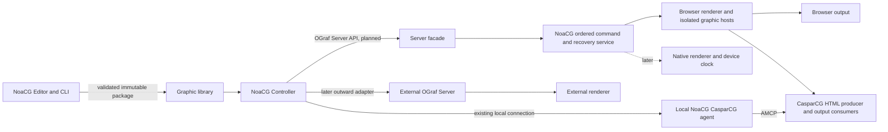

# NoaCG Editor, Controller, OGraf Server and Renderer

**Architecture proposal and implementation handoff, 2026-09-13. Research only.**
This plan applies the [OGraf Studio source comparison](OGRAF_STUDIO_RESEARCH.md) to the existing
[ratified OGraf direction](OGRAF_FIRST_REVIEW.md). It does not change the NOW push, start the
parked native-renderer programme, replace the modular-monolith domain registry, or assert that
the proposed Server API and foreign-package production surfaces already exist.

## 1. Destination and boundaries

The destination remains **NoaCG Editor -> NoaCG Controller -> OGraf Server/API -> Renderer ->
professional/browser output**. Those are responsibilities and interoperability seams, not five
mandatory installations. CasparCG is an output/rendering path now; a native NoaCG engine is a
possible much later implementation behind the renderer boundary.

The diagram's logical server facade can be served from an appropriate backend or local service;
the browser `/output` page cannot itself accept inbound HTTP Server API requests. Existing
documents that say "`/output` speaks the API" describe the **output service**, not an HTTP server
inside that page. Hosted control, local control and future external Server API control should
reach one command application path instead of each acquiring its own state engine.

| Responsibility | Owns | Must not own |
|---|---|---|
| Editor/authoring library | Code document, deterministic transforms, source assets, preview and export validation | Current on-air state, hardware connections or renderer recovery |
| Controller | Rundown/cues, operator inputs/actions, target selection, effective data and command intent | Native renderer internals; a competing graphics document |
| Server facade | Standard catalog/renderer/instance methods, input validation, target addressing, translation to execution | A second command queue that bypasses ordering or invents OGraf endpoint semantics |
| Command/recovery service | Ordering, authority, acknowledgements, baselines, replay and visibility of uncertain results | Promise of exactly-once execution at an arbitrary third-party renderer |
| Browser renderer | Instance lifecycle, resource readiness, isolated execution, composition, reports | Authoring model reconstruction or external data credentials |
| Playout client/local agent | Facility connection, AMCP and process/device configuration, diagnostics | Reimplementation of graphic animation or a fork of the controller |
| Native renderer, later | Frame pacing, raster/compositing, pixel format, audio and device output | New operator semantics or mandatory proprietary package format |

## 2. What already exists

The source-authority object is `SpxTemplate` in `src/model/types.ts`: HTML, CSS, JS and assets,
with fields/settings derived from the code. `NOACG_ANIM` and the machine live in readable source;
the timeline edits their supported representation. Unsupported legacy animation code is read-only
in the visual projection. The OGraf exporter and source-bearing package are adapters off that
document, not alternate authoring authorities.

The CLI drives `src/bridge/`, which uses the deployment's own transforms, gate, bench and exports.
It already handles a foreign OGraf package for inspection/validation, but this is not equivalent
to first-class foreign-package library and production support. `src/control/ografContract.ts`
derives fields/actions with known GDD coverage gaps. Those gaps remain visible rather than silently
converted into invented editable controls.

`src/control/hostedControl.ts` provides the durable log follower; `src/output/main.ts` restores
per-graphic data and visual state from baselines and catches up off air. `src/output/stage.ts`
composes layered hosts. `noacg caspar agent` holds the AMCP socket for the studio because the
browser cannot speak raw AMCP TCP. The shipped roads and real-hardware evidence remain documented
in [BRIDGE.md](BRIDGE.md), [CLOUD_PLAYOUT.md](CLOUD_PLAYOUT.md) and
[ACCEPTANCE_SPX_CASPARCG.md](ACCEPTANCE_SPX_CASPARCG.md).

These source paths are starting points, not permission to import higher-level modules into lower
ones. New public seams must conform to [ARCHITECTURE.md](ARCHITECTURE.md). No shared module
extraction or schema migration is performed in this research phase.

## 3. Graphic contracts and authoring decisions

### One source, multiple projections

Keep the native source document canonical. A future property-track surface reads supported
`NOACG_ANIM` source and emits a deterministic readable patch through the existing animation edit
boundary. Generated descriptors may exist as transient execution data, but must never become a
separately saved scene that competes with the code. Preserve unrecognized code and explain which
visual operations are unavailable. The native document's persisted version and migration contract
are distinct from the OGraf specification version and the graphic's user-facing version.

Separate three clocks: the finite authored timeline, the current lifecycle step, and elapsed
on-air/local-loop time. Studio supplies evidence for that distinction. A clock/ticker that runs
during a hold must not force lifecycle promises to wait forever. Conversely, reaching an arbitrary
time in an animation does not automatically mean an operator step has completed.

The next animation design must specify property conflict rules: field-driven values versus
authored tracks, two tracks targeting the same property, update crossfades versus running loops,
and interruption during entry/exit. Prefer one shared sampler/interpolation definition for
authoring, scrubbing, exported playback and evidence capture. Preserve runtime replaceability;
do not add GSAP-only concepts to the public authoring contract.

### Runtime package and capability honesty

An OGraf runtime package comprises manifest, default-exported graphic module and resources. It
must play without its editor, source metadata or internet/CDN dependencies for NoaCG exports.
NoaCG-native source pointers/version/hash may travel through `v_noacg`; removing them must not
break runtime playback. Preserve foreign vendor keys without treating them as standard semantics.

Model import capability explicitly: native editable source, foreign playable/data-editable package,
or a conversion with a precise loss report. Do not overwrite an opaque foreign runtime with a
blank or approximate scene merely because its manifest can be parsed. Keep original bytes and
asset paths for foreign playback.

`supportsNonRealTime` is an executable promise. NoaCG's future deterministic profile needs
schedule replay, backward seeking, resettable effects and a policy for external inputs, wall-clock
timers and custom actions. Defer that claim for general graphics until a declared supported subset
passes repeated-seek tests. A native realtime renderer does not require every graphic to support
non-real-time rendering.

### Binding and behaviour

Use a stable field key plus a list of visual targets/properties and an optional bounded source
path/value map. Shared fields must update all targets in preview and every export. GDD represents
public operator data; it does not describe all NoaCG machine legality or private design metadata.
Native behaviours continue to expose curated actions from the machine/control contract.

For generic foreign controls, resolve standard `gddType` and its fallback chain before vendor
hints, preserve typed values/defaults and report unsupported nested shapes. Array/table support
requires real descriptor and transport design; flattening everything to strings would destroy
the input contract. Extend existing control rendering rather than embedding a competing panel.
Use `ograf-form` only as an external oracle unless a later measured need changes that decision.

The controller or its data service should own replayable effective values. A scoreboard command
such as +1 must not be repeated after an uncertain transport result. Preserve a controller-owned
score snapshot where possible; an opaque foreign `customAction` may have effects that cannot be
reconstructed. The recovery capability must state that limitation instead of inventing machine
state. [OGRAF_STATE_IN_FIELDS.md](OGRAF_STATE_IN_FIELDS.md) remains the current state-via-data rule.

## 4. What ograf-server proves, and what it does not

At `f6d86255...`, SuperFlyTV's server routes standard calls through Koa to a renderer WebSocket
using JSON-RPC. The renderer is a browser page; the inspected layer manager creates five layers
(a stale comment says ten). Each layer holds one active graphic instance. On load the old instance
is cleared, the new component is created and `load` is awaited with data and render characteristics.
It advertises a GDD render-target schema with `layerId` choices.[^1]

The previous dossier's inference from a commented `listGraphicInstances()` TODO was too broad:
`LayerHandler.getInfo()` returns its current instance and `RendererApiHandler` reports target
information. That proves current discovery exists, **not durable recovery**. Layer/instance state
is kept in the browser's in-memory objects. No durable restoration of those objects after a page
restart was found in the inspected path. NoaCG's log/baselines remain a distinct reliability asset.
The reference's private target status property must not be confused with standard instance data
or a state stream.[^1]

Use `ograf-server` for a real foreign controller/server/renderer path. Do not import its
Koa/MobX/JSON-RPC application as NoaCG's backend. Its upload/namespace mechanisms are vendor
features; the EBU API does not standardize ingestion or authentication. The OpenAPI definition,
not a sample server's defaults, determines the facade's required endpoints and response bodies.

## 5. Server facade design for independent implementation

### Identity and routing

Distinguish **graphic ID** (catalog identity), **package revision/content hash** (immutable bytes),
**renderer ID** (one registered executor), **render target** (opaque JSON validated against its
advertised GDD schema) and **graphic instance ID** (one loaded lifetime). A reloaded instance gets
a new ID. Commands for a disposed ID cannot act on its replacement, even on the same target.
Pin the package revision for the entire instance lifetime; replacing a library graphic cannot
silently change an on-air instance's files.

Use the EBU OpenAPI paths relative to a configured base URL. `/ograf/v1` is a reasonable default,
not a mandated prefix. Prototype the following translation table as pure mappings before adding
HTTP handlers. Preserve the specification's actual envelope, filters, errors and optional values;
do not design a generic REST CRUD API and label it OGraf.[^2]

| API family | Internal action | Completion/evidence requirement |
|---|---|---|
| GET root, graphics, graphic detail | Read catalog/versioned resource reference | Result describes the available package, not mutable editor state |
| DELETE graphic | Unlist/remove according to standard options | Preserve resources needed by loaded instances |
| GET renderers, renderer detail and targets | Read registered capabilities and current instance inventory | Distinguish unreachable, stale and empty; no invented per-instance state stream |
| target/graphicInstance/load | Validate target/data; reserve instance; enqueue load | Await graphic readiness; return actual instance identity and result |
| updateAction | Ordered typed data update for the selected instance | Reflect graphic ReturnPayload; do not report success on queue insertion |
| playAction | Preserve goto/delta/skipAnimation semantics | Reflect completed step or end; no extra state transitions in facade |
| stopAction | Ordered animation-out request | Resolve according to the graphic's lifecycle result |
| customActions/{id} | Validate action ID/payload against manifest | Treat arbitrary effects as non-idempotent unless explicitly guaranteed |
| clear routes | Apply standard scope/filter; dispose selected instances | Cannot clear a newly loaded replacement through an old instance ID |

Exact methods and locations of clear/target discovery come from the pinned YAML. The table is
a responsibility map rather than a replacement endpoint specification.

### Ordering, acknowledgement and recovery

The facade writes through the existing command authority. Add correlation from request to
execution outcome; an HTTP response must distinguish command accepted, graphic completed,
graphic returned an error and transport completion unknown. Do not return a fabricated graphic
200 when only the log append succeeded. Keep HTTP transport failure and an OGraf graphic's
`statusCode`/`statusMessage` distinct according to the EBU envelope.

A proposed internal command envelope needs the target/instance ID, immutable package revision,
command ID, ordering position, params, issue time and execution outcome. Reuse existing log fields
where possible; this is not a proposed second persisted schema. First map current columns/types
and migrations before adding anything. Acceptance must cover two controllers issuing simultaneous
commands and an executor reconnecting after the requester's timeout.

Within NoaCG, record applied IDs/baselines and restore data then visual state off air using the
existing recovery discipline. At an external Server API boundary, no standard idempotency token,
durable event log or action-result replay is promised. If a custom action or relative step times
out, query what the standard can actually reveal, report uncertainty and require an explicit
reconciliation policy. Never automatically retry +1 or Next merely because the response was lost.

Use exclusive command authority/fencing if multiple executors can claim the same target. Whether
that is needed in the first facade slice must be established from the existing deployment model.
It is a reliability design question, not a field that can be assumed to exist today.

### Security and deployment

Untrusted OGraf is executable JavaScript. Foreign production import depends on a tested host
isolation boundary: separate origin or suitably sandboxed frame, no controller credentials,
bounded message bridge, asset-path containment and explicit network policy. Shadow DOM is styling
encapsulation, not an execution sandbox. Studio's disposable certification iframe is not evidence
that foreign production execution is safe.

The Server API does not mandate authentication. Apply NoaCG access/production authority at the
facade; do not expose a facility's AMCP socket to the public internet. Local facility connectivity
stays in the existing loopback agent or a later managed local service. Hosted and offline routes
must be documented separately; the current hosted `/output` requires backend configuration,
whereas offline exported templates remain a viable production route.

## 6. CasparCG acceptance before a new engine

Two current paths must remain distinct: a self-contained exported HTML template loaded directly
by CasparCG, and a browser production `/output` URL loaded once and controlled through NoaCG.
A future OGraf-hosting page is a third package-hosting path. CasparCG does not become an OGraf
Server merely because it can display a URL containing OGraf graphics.

The local NoaCG client/agent controls an existing CasparCG server over AMCP. CasparCG's HTML
producer/CEF renders the page; its configured consumers handle output. The editor has no SDI,
NDI or genlock responsibility. Current official source confirms CasparCG's separate producer and
consumer architecture; exact installed versions and device settings must accompany the acceptance
record, not be inferred from the latest release page.[^3]

Required real-production matrix, recorded per installed setup:

| Scenario | Evidence to retain |
|---|---|
| Import student's SVG quiz and scoreboard, bind, animate, add to production | Route, package hashes, source/field inspection, correct +1/-1 and lock/reveal |
| Load from clean CasparCG start via agent; repeat via documented manual fallback | Versions, channel/layer/config, command replies and visible output |
| Fonts/assets with internet unavailable on the offline package route | No fallback glyphs, missing assets or remote dependency; correct relative base paths |
| Entry, rapid update, step, exit, replay | Video of actual output and operator state, including interruptions |
| Multiple stacked graphics and clear | Only intended layers clear; transparent areas/key edges remain correct |
| Controller disconnect/reconnect; output refresh; local agent restart | No duplicate score increments, stale takeover, blank recovered scoreboard or replay visibly aired |
| Resolution/frame rate and representative show-duration run | Actual configuration, dropped/late-frame evidence where available, memory trend and visual review |
| SDI fill/key or other actual production consumer | Physical/output capture, alpha edges, timing and facility acceptance; label browser-only tests separately |

Existing hardware walks remain owner-queue records, not a blanket prohibition on other work.
This matrix adds specificity to future acceptance and takes practical priority over a native
renderer spike. Automated fake-AMCP/browser tests establish useful subsets, never physical output.

## 7. Native renderer: preserve the seam, defer the engine choice

The earlier [native playout dossier](NATIVE_PLAYOUT_RESEARCH.md) remains useful for CasparCG,
GStreamer/gstcefsrc and browser-to-raster alternatives. Its "rent the engine forever" wording is
an implementation preference from that research, not a permanent ban on the long-term NoaCG
stack. The destination allows a later NoaCG renderer composed from third-party engine components.
No engine is selected or licence-cleared by this round.

A renderer experiment must measure a device-paced frame contract: who owns the clock, when a
browser frame is requested, when it is available, how frames cross the GPU/CPU boundary, queue
depth, late-frame policy, colour space/premultiplied alpha, interlace if needed, key/fill alignment
and sustained performance. `requestAnimationFrame` smoothness on a laptop is insufficient.
Non-real-time seek reproducibility is a separate property from realtime output pacing.

Before selecting GStreamer, CEF/Chromium, DeckLink, NDI, FFmpeg or any combination, refresh exact
component licences and SDK redistribution terms. The native-renderer decision requires a measured
output target and long-run evidence after the existing CasparCG route has been exercised in real
production. Studio's editor/runtime has no evidence that settles this choice.

## 8. Work packages and dependency order

**Editor follow-up, 2026-09-14:** the owner requested a concrete rebuild of the basic editing
experience. [EDITOR_PLAN.md](EDITOR_PLAN.md) now owns the SVG-first release sequence
for that work, extending package C beyond schema research into interaction quality. It is
not dependent on the later Server API or native-renderer packages. Product work has not
started in the research task.

All new items below are parked planning artifacts. "Ready to specify" is not "start now".
Existing NOW work continues. The scopes intentionally avoid simultaneous changes to the canonical
model, generic control adapter and output host by unrelated implementation sessions.

| Package | Starting point / ownership | Depends on | Completion contract |
|---|---|---|---|
| A. External fixture and conformance matrix | Export validation and external test harness; [backlog](backlog/ograf-studio-interop-matrix.md) | Pinned sources/licence notices | Runtime-only and source-bearing exports tested separately; expected failures explicit |
| B. CasparCG production acceptance | Existing agent, output and production scenarios; [backlog](backlog/casparcg-production-acceptance-matrix.md) | Actual installed setup for hardware leg | Quiz/scoreboard route, interruptions/recovery and actual output evidence |
| C. Code-backed property tracks and lifecycle design | Existing `animData`/`animEdit`/`animEval` seams; [backlog](backlog/ograf-property-tracks-lifecycle.md) | Review current animation plan; fixture definitions from A | One authoritative code format, migration plan and shared sampler; no second scene source |
| D. Agent revision/evidence contract | CLI, bridge and existing transforms; [backlog](backlog/agent-authoring-revisions-evidence.md) | Native source hash/version mapping | Atomic stale-write rejection; visual evidence tied to exact source and exported bytes |
| E. GDD generic control coverage | `ografContract` and existing control descriptors; [existing backlog](backlog/ograf-form-oracle.md) | Schema oracle from A | Typed values, fallback order, action payload forms and explicit structured-data limits |
| F. Foreign package hosting | Existing OGraf import/host and `/output`; GOALS ladder | Isolation proof plus A/E | Foreign packages remain opaque/playable; no unsafe code conversion or second output service |
| G. Server API facade contract and implementation | Existing control log and backend boundary; [backlog](backlog/ograf-server-api-contract.md) | F and identity/acknowledgement design | Standard endpoint parity, instance addressing, no fabricated success or unsafe retries |
| H. Outward controller adapter | Control command boundary; same Server API backlog | G semantics proven; external server fixture | Targets discovered from GDD, uncertain completion surfaced, no assumption of NoaCG recovery remotely |
| I. AE/Lottie field/marker adapter | Sealed asset import; [existing backlog](backlog/ograf-lottie-ferryman-conventions.md) | A fixtures and explicit supported profile | Content replacement/marker lifecycle without claiming full AE or editable-path parity |
| J. Native renderer study | Native output process, not editor | Production need plus refreshed device/SDK evidence | Measured paced output and recovery before an engine decision; stays parked |

C and D can be designed independently; implementations touching canonical source/version seams
must agree on the shared contract before branching. E is a focused extension of the existing
control model. F/G/H remain the existing ladder, not a newly authorized competing programme.
No outreach, release or production deployment is part of these research changes.

## 9. Decision gates and validation receipts

Every later work package must attach a receipt with NoaCG commit, source/package hash, tool and
schema versions, host/browser or CasparCG version, exact actions/data, actual outcome and skipped
legs. A passing local gate must not be described as an independent renderer test. A foreign
editor's round-trip is never equivalent to lossless code editing.

Before choosing an editor architecture change: prove an imported scoreboard, a multi-step reveal,
an animated text update, a holding local loop and an unsupported handwritten-code case. Before
exposing foreign playout: prove isolation and typed operator control. Before exposing the Server
API: prove correlation, instance identity, retry/recovery semantics and standard envelope tests.
Before selecting a native renderer: prove the actual output clock and device path.

Run browser-driving verification through `npm run queue` under the machine-wide queue rule and
map each new product flow to its Playwright spec. Product changes add their own human acceptance
file. This research contains no new flow and therefore adds no product acceptance claim.

## Sources

[^1]: SuperFlyTV, pinned [server routes](https://github.com/SuperFlyTV/ograf-server/blob/f6d86255bfc8cd5aa77fa6ba227b5adcd6d363dd/packages/server/src/serverApi.ts), [renderer protocol](https://github.com/SuperFlyTV/ograf-server/blob/f6d86255bfc8cd5aa77fa6ba227b5adcd6d363dd/packages/shared/src/rendererAPI.ts), [layer manager](https://github.com/SuperFlyTV/ograf-server/blob/f6d86255bfc8cd5aa77fa6ba227b5adcd6d363dd/packages/renderer-layer/src/lib/LayersManager.ts), [layer/instance lifecycle](https://github.com/SuperFlyTV/ograf-server/blob/f6d86255bfc8cd5aa77fa6ba227b5adcd6d363dd/packages/renderer-layer/src/lib/LayerHandler.ts), [renderer API handler](https://github.com/SuperFlyTV/ograf-server/blob/f6d86255bfc8cd5aa77fa6ba227b5adcd6d363dd/packages/renderer-layer/src/lib/RendererApiHandler.ts).
[^2]: EBU, [Server API notes](https://github.com/ebu/ograf/blob/c821671195a077be13bbb96989d4220eea157b99/v1/specification/docs/Specification_Server_API.md), [normative OpenAPI](https://github.com/ebu/ograf/blob/c821671195a077be13bbb96989d4220eea157b99/v1/specification/open-api/server-api.yaml). Inspected 2026-09-13.
[^3]: CasparCG, [official server repository](https://github.com/CasparCG/server), [official AMCP protocol reference](https://casparcg.com/docs/wiki/protocols/amcp-protocol). Existing NoaCG measurements: [NoaCG Bridge](BRIDGE.md), [playout integration](PLAYOUT_INTEGRATION.md), [native playout research](NATIVE_PLAYOUT_RESEARCH.md). This round did not rerun hardware acceptance or pin a facility's installed CasparCG version.
