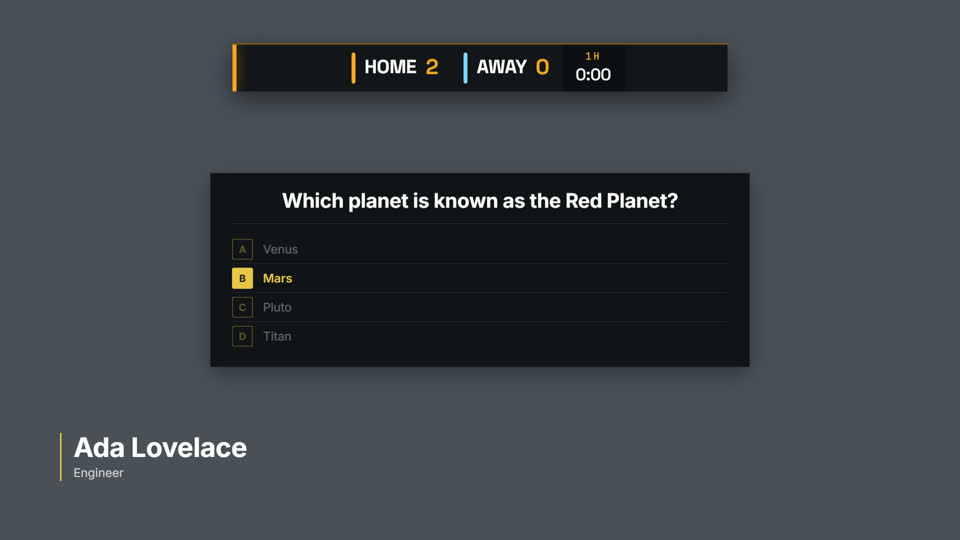
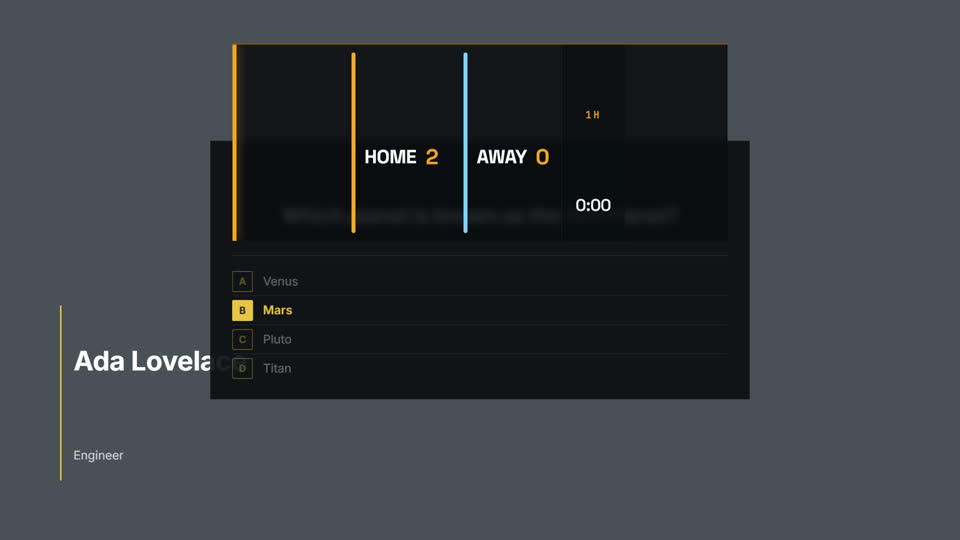
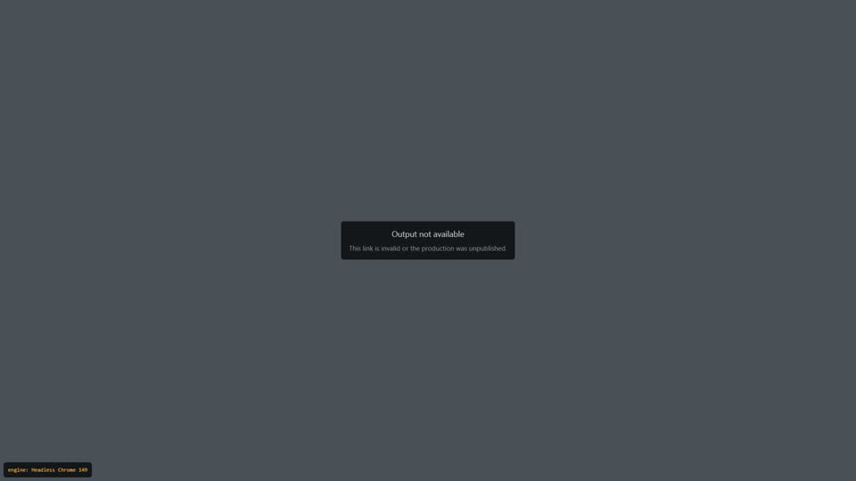
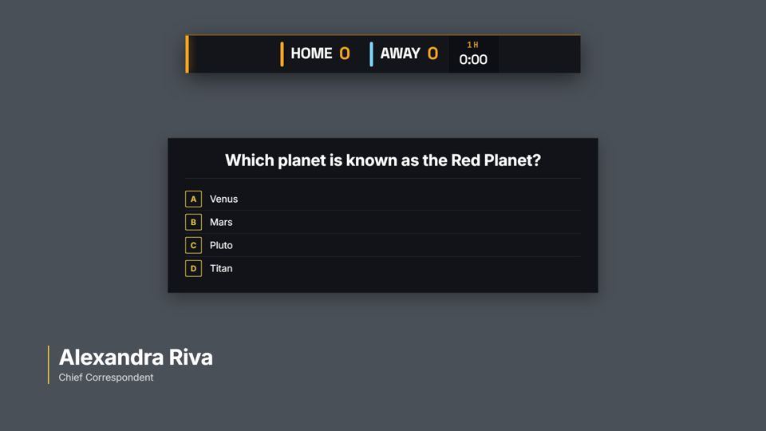
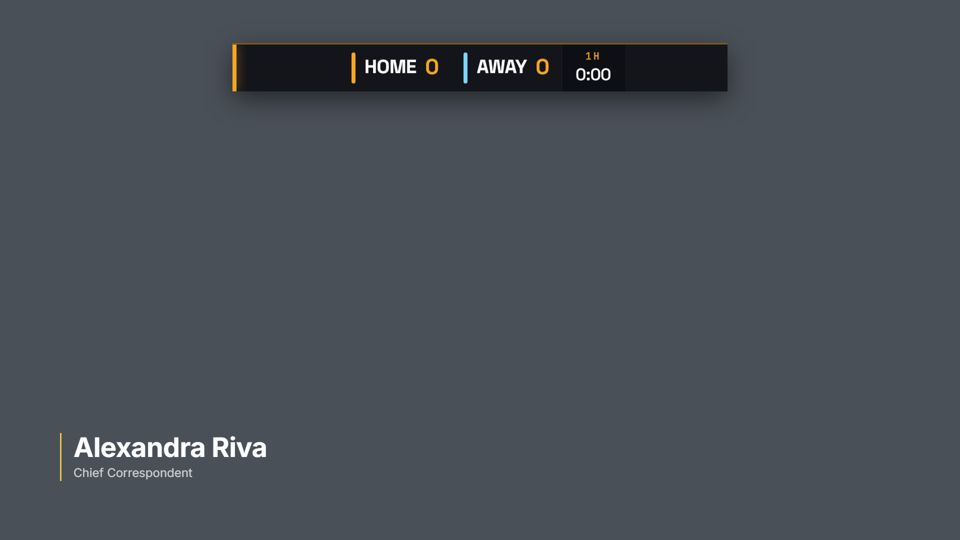
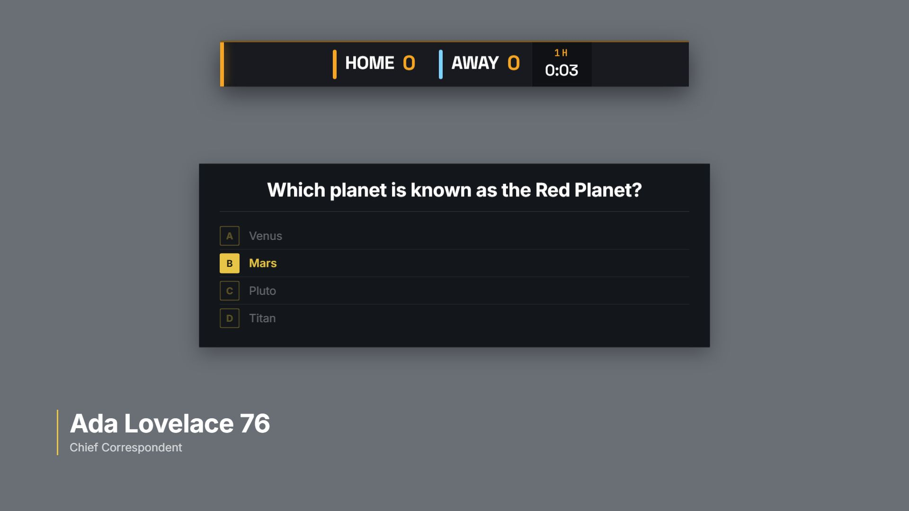

# NoaCG on a real SPX server

A record of NoaCG graphics played out through real SPX servers on 2026-09-30, by each of NoaCG's
three SPX routes, and what it means for SPX users. Every result below was seen on a running
server; where a claim rests on reading SPX's source instead, it says so.

**Answers first.**

- **The native SPX export works on both servers.** Fields, Play, Continue and Stop work on SPX
  1.4.1 and 1.2.1, and three NoaCG graphics played on three layers at once. Update works on
  1.2.1 and does nothing on 1.4.1, for every HTML template, because of an SPX 1.4 defect.
  Out of the box every NoaCG graphic landed on the same layer, so each Play evicted the last;
  since the fixes in §9 the three land on their own layers on both servers as imported.
- **The OGraf package works only partly on SPX 1.4.1.** As imported it does not play at all (SPX
  gives it layer `NaN`). With layers set by hand it plays, continues and stops, three at once,
  but the graphics render distorted, dropdowns and colours arrive as plain text boxes, and custom
  action buttons do nothing. Update does nothing, as for HTML templates. Since the fixes in §10 it
  plays as imported, on its own layer, with SPX's own controls and at its authored size, and its
  custom actions fire once the project loads the handler script the package carries. Update
  still does nothing: that is SPX's.
- **The output embed loads and frames the production on both servers, but puts an opaque dark
  frame over the whole picture**, which stays after Stop. A small change, tested here in a
  scratch copy, makes it transparent; it shipped, and §9 walks the shipped file transparent on
  both servers. This is a likely cause of the owner's failed attempt,
  alongside the framing refusal that PR #550 removed; the refusal is gone on production now.
- **Verdict on "SPX renders in the operator's own browser":** half true. The operator's
  controller page runs a full copy of the renderer as its monitor, so a template has to work in
  the operator's browser too, but what goes on air is the `/renderer` page in whatever loads it
  (OBS, vMix, CasparCG or a browser window), on that host's engine. Details in §5.

## 1. The servers

### SPX 1.4.1, built from source

The MIT source at tag `v.1.4.1` of <https://github.com/TuomoKu/SPX-GC> (commit `220dbfa`), in its
own folder beside the installed 1.2.1, never over it:

```
cd C:\spx
git clone --depth 1 --branch v.1.4.1 https://github.com/TuomoKu/SPX-GC.git SPX_1_4_1_source
cd SPX_1_4_1_source
npm ci --omit=dev          # 288 packages, 12 s, Node 24.13
node server.js             # first start writes config.json with defaults
```

Start it again with `cd C:\spx\SPX_1_4_1_source` and `node server.js`; stop it with Ctrl+C.
It listens on port **5656** (the default in `utils/spx_getconf.js`, which settles the research's
5656-or-5660 question) and on every network interface, with no password. The first page asks
whether to use a username and password; this install answered No. `GET /api/v1/version`
answered `{"product":"SPX Solo","version":"1.4.1"}`. The repository's `npm run build` is a
`pkg` packaging step (the commercial binaries); running the source with Node is the free build,
and nothing was bought or registered.

### SPX 1.2.1, installed

`C:\spx\SPX_1_2_1_win64\SPX_win64.exe`, port 5656, `{"product":"SPX","version":"1.2.1"}`. It
predates OGraf, so only the native export and the output embed apply. Only one server ran at a
time.

### How it was driven

Everything went through SPX's own pages in Playwright's Chromium 149: the projects page's New
button, the template browser in project settings, the rundown's Add all, and the controller's own
Play, Continue, Update, Save and Stop functions (`playItem`, `nextItem`, `updateItem`,
`saveTemplateItemChangesByElement` in `static/js/spx_gc.js`). A second page loaded
`http://localhost:5656/renderer` at 1920x1080 as the program output; after every press the walk
screenshotted it and read which template each layer held. A mid-grey was painted behind the
transparent renderer page so white type shows. The desktop app's browser pane could not draw
while the app was in the background, so it was used only to answer SPX's first-run question.

The graphics were three catalog designs built by the real exporters (`spxTarget`, `ografTarget`,
`outputEmbedHtml`) from this branch: **Hairline** (lower third, two text fields), **Clean Quiz**
(two steps, two dropdowns, five custom actions) and **House Scorebug** (numbers, colours, six
custom actions).

## 2. Route 2, the native SPX export (works, with two gaps)

Each graphic's SPX folder went into `ASSETS/templates/noacg_round/spx/`, one folder per graphic,
and was added through project settings (one folder at a time, because the template browser adds
from one folder).

| | SPX 1.4.1 | SPX 1.2.1 |
|---|---|---|
| Import | All three import; field types kept (dropdown, number, color) | Same |
| Layer as imported | **5 for all three** (the package says 7; 1.4 caps layers at 5) | **7 for all three** |
| Fields | Edit, Save, Play: "Ada Lovelace / Engineer" on air | Same |
| Play | Works | Works |
| Update (edit, Save, Update) | **Nothing changes on air**; renderer throws `TypeError ... at updateItem (spx_gc.js:2712)` | Works: "Engineer" became "Mathematician"; score 0 became 1 |
| Continue (quiz, `steps: 2`) | First press reveals the answer; a second press takes the item out | First press reveals; after a second press the controller shows the item as stopped but **the quiz stays on screen**, so Stop is no longer offered for it (the walk did not try a recovery) |
| Stop | Works | Works |
| Two graphics, default layers | **Each Play replaces the last** (all on one layer) | Same |
| Three graphics, layers set to 1, 2, 3 (1.4.1) or 7, 8, 9 (1.2.1) in project settings, rundown rebuilt | All three on air together; the lower third and the scorebug stopped alone, the quiz left with its second Continue | All three on air together; the lower third and the scorebug stopped alone, the quiz stayed after its second Continue as above |



Two more things an operator meets:

- **The template browser lists `controlpanel.html`** beside every graphic's template. Adding it
  fails with SPX's "template definition missing". SPX hides files whose names start with `_` or
  `.` (`GetFilesAndFolders` in `utils/spx_server_functions.js`).
- **Update in 1.4.x is an SPX defect, not ours.** Update sends its data without the project
  format, and the renderer then defaults to OGraf and calls the controller's `updateItem()`, which
  fails in the renderer page because it has no rundown (`#datafile` is null;
  `views/view-renderer.handlebars`, `case 'updateTemplate'`). It is still unfixed on SPX's
  master branch; an open pull request (#161, 2026-03-13) sets the default back to SPX. On 1.4
  the working equivalent is Save, then Stop and Play.

## 3. Route 3, the OGraf package on SPX 1.4.1 (partly works)

A 1.4 project is either SPX or OGRAF format, chosen when it is made; an OGRAF project's template
browser lists only `.json` files. So OGraf packages and SPX templates do not share a rundown.
The three packages went into `ASSETS/templates/noacg_round/ograf/`.

| Step | Result |
|---|---|
| Import | Fields become text boxes, except numbers (a number field). The quiz's two dropdowns and the scorebug's two colours arrive as text boxes. Each custom action becomes a button. |
| Layer as imported | **`"NaN"`** for every package (`playlayer` and `webplayout` in the profile). `spx.max5(undefined)` returns the string `"NaN"`, which is truthy, so the `|| "1"` default never applies. |
| Play, as imported | **Nothing appears and nothing is logged.** |
| Layers set to 1, 2, 3 in project settings, rundown rebuilt | Play works; all three on air together, as `<noacg-hairline-v1.0.0>` and siblings in the renderer's `div1` to `div3` |
| Fields | Edited values reach `load()`: "Ada Lovelace / Engineer", home score 2 |
| Continue (quiz) | `playAction` reveals the answer |
| Custom action buttons | **Dead**: `ReferenceError: customActionHandler is not defined` in the controller. The name appears nowhere in SPX 1.4.1's source except where the import writes it. The button also names a layer, taken at import from the manifest's `v_spx.webplayout` or `"1"` when there is none, and never updated: every NoaCG button says layer 1 (`customActionHandler('judge', '1')`) while the quiz plays on 2 and the scorebug on 3. |
| Update | Nothing changes. For OGraf the renderer always calls the controller's `updateItem()` (`updateLayer` in `views/view-renderer.handlebars`), so the upstream fix for §2 would not help this route |
| Stop | `stopAction` works; the layers empty |
| Look | **Distorted**: the scorebug bar is four times its height, the lower third's name and title are 200 px apart |



**Why the graphics distort.** SPX's renderer page sets `body, html { font-size: 3em }`, so its
body text is 144 px, and a NoaCG graphic is a custom element in that page's light DOM, inheriting
it. A bare page that loads the package and adds SPX's rules one at a time (the probe below)
isolates it: SPX's `*` reset and its `.ografRenderTarget` sizing change nothing or a few pixels;
the font-size rule alone moves the scorebug's text from y=113 to y=294. The graphic's own sheet
does not set a font size on its element, so nothing stops the inheritance.

**The two questions the OGraf round carried** (`docs/backlog/spx-gc-ograf-round.md`):

1. *Does the graphic restyle the renderer's page?* No. With a package loaded, a fresh element in
   the host page computes the same font, size, colour and box model as before, and none of the
   package's style blocks addresses `html`, `body` or `:root`. The leak runs the other way: the
   host restyles the graphic.
2. *A renderer whose viewport differs from the canvas.* SPX sizes the graphic element to 100% of
   its render root, and the root is fixed at the configured resolution (HD, 1920x1080) whatever
   the window size. A 1280x720 window cropped both routes rather than scaling them. A canvas that
   is not 1920x1080 was not tried; from the CSS it would sit at its authored size in the top left.

**OGraf in SPX's CasparCG path:** an imported OGraf item has `playserver: OVERLAY`, and SPX sends
any such item to CasparCG when a CasparCG server is configured, but `utils/playout_casparCG.js`
has no OGraf code, so it would be sent as if it were an HTML template. Read from source; no
CasparCG server was connected, so what CasparCG does with it is untested.

## 4. Route 1, the output embed (loads, but covers the picture)

The file the production page offers as "Template file" (`src/export/outputEmbed.ts`), built by the
real function, went into `ASSETS/templates/noacg_round/embed/`. Three copies:

- `noacg_round_local_output.html`, pointing at this worktree's dev server
  (`http://localhost:5258/output?production=spx-round-local`);
- `noacg_round_prod_output.html`, pointing at production
  (`https://noacg.studio/output?production=spx-round-not-published`, a slug that does not exist);
- `noacg_round_prod_fixcheck_output.html`, a hand-edited copy for the fix below.

No published production was available (publishing needs the owner's account, and this worktree's
dev server has no backend and reports "offline"), so the check is that the output page loads and
behaves inside SPX, using its `&debug=1` readout, which the embed's Debug checkbox turns on.

| Step | SPX 1.4.1 | SPX 1.2.1 |
|---|---|---|
| Import | One item, layer 5 (the file says 20; 1.4 caps at 5), `steps: 1`, fields: instruction, Output URL, Debug, Stay dark, Reload button | The same fields, layer 20 |
| Play, local dev server | Output page loads in the SPX layer and reports `offline` in the renderer console | Not run (1.2.1 walk used the production URL) |
| Play, production URL, Debug on | **Production's `/output` loads framed inside SPX** and shows "Output not available: this link is invalid or the production was unpublished" with `engine: Headless Chrome 149` | Same |
| The picture around it | **Opaque dark grey over the whole 1920x1080 frame** | Same |
| Stop | The debug card goes; **the dark frame stays** | Same |
| Reload output button | **Dead**: `ReferenceError: noacgReloadOutput is not defined` in the controller | Not pressed |


**Why the frame is opaque.** The embed declares `<meta name="color-scheme" content="dark">` so its
own iframe matches the output page (`docs/CLOUD_PLAYOUT.md` §3, rule 2). That holds when the
embed is the top document (a CasparCG template folder or a browser source). In SPX the embed is
itself inside an iframe of SPX's renderer, which declares no colour scheme, so Chromium paints
SPX's layer iframe opaque with the dark canvas. Two measurements settle it: adding
`:root { color-scheme: dark }` to SPX's renderer page made the frame transparent; and the
fix-check copy, with the `meta` tag removed and `color-scheme: dark` set on the embed's
`<iframe>` element instead, was transparent on both servers, in play and after Stop, with the
debug card still showing.



**Why the button is dead.** An SPX `button` field's `fcall` runs in the controller page, not in
the template, so a function the template defines is out of its reach.

**The framing refusal is gone.** On 2026-09-30, `https://noacg.studio/output` answered with
`Content-Security-Policy: object-src 'none'; base-uri 'self'; form-action 'self'` and no
`X-Frame-Options`, while `https://noacg.studio/` still sends `frame-ancestors 'self'` and
`X-Frame-Options: SAMEORIGIN`. The framed production page above is the same fact seen from SPX.

So the owner's failed attempt had at least two causes: before PR #550 production refused to be
framed at all, and today the embed still hides the video behind a dark frame in SPX. What stays
unproven is a real published production's graphics cued from NoaCG while SPX frames them; that
check is `docs/acceptance/owner-queue/2026-09-30-r-spx-output-embed.md`.

## 5. Where SPX renders

The controller page (`views/view-controller.handlebars`) contains an iframe named `LOCAL` whose
source is the same `/renderer` page, and it receives the program commands: in every 1.4.1 walk the
Update error was reported twice, once by the program renderer and once by the controller page's
copy. The program output is the `/renderer` page in whatever loads it; in this round that was
Playwright's Chromium 149, and in production it is the browser source of OBS or vMix, CasparCG's
HTML producer when SPX plays through CasparCG, or a browser window. So a template runs in two
engines at once: the host's, on air, and the operator's browser, as a monitor. The engine table
row "SPX renders in the operator's own browser" should say the on-air engine is the host that
loads the renderer, and that the operator's browser runs a monitor copy. The correction to
`src/validation/engineSupport.ts` and `docs/PLAYOUT_COMPATIBILITY.md` is tracked in
`docs/backlog/playout-engine-facts-and-guide-corrections.md`.

## 6. How NoaCG should serve SPX users

**Which route for which setup.**

| The SPX user | Route | Why |
|---|---|---|
| Runs SPX with its web renderer in OBS, vMix or a browser, and wants SPX to own the show | **Native SPX export** | The only route that works end to end today, on 1.2 and 1.4, with the field types SPX shows |
| Plays out through CasparCG from SPX | **Native SPX export** | SPX has no OGraf handling in its CasparCG path |
| Wants NoaCG's production page, control link or phone to run the graphics, with SPX only putting the output up | **Output embed**, once its frame is transparent | Cues stay in NoaCG; SPX sees one item |
| Standardises on OGraf across renderers | **OGraf package**, only after the fixes in §7 | Today it does not play as imported and renders distorted |

**What an SPX operator expects that we do not give.**

1. Graphics on distinct layers inside SPX's range, so two can be on air together without a trip
   to project settings. Every NoaCG route lands them on one layer today.
2. A rundown, not a folder of templates: SPX projects are files, and our production export
   writes none (`docs/backlog/spx-show-export-rundown.md`, not exercised here because nothing
   writes a rundown yet).
3. The right controls: dropdowns and colour pickers in the OGraf route, and no stray
   `controlpanel.html` in the template browser.
4. Update that works on SPX 1.4. It is SPX's defect, but our packages can say "Save, then Stop
   and Play" until SPX ships a fix.
5. Buttons that do something: the embed's reload button and every OGraf custom action are dead
   in SPX 1.4.1.

**What to build first.**

1. **The embed's colour scheme** (`docs/backlog/spx-output-embed-opaque-frame.md`): a small
   change in one file, measured fix, and it unblocks the route the owner tried.
2. **SPX-safe layers** (`docs/backlog/spx-layers-collapse-onto-one.md`): every route, every SPX
   version.
3. **The OGraf package's layer and type hints** (`docs/backlog/ograf-package-does-not-play-in-spx.md`
   with `docs/backlog/ograf-manifest-v-spx-hints.md`), then **the inherited font size**
   (`docs/backlog/ograf-graphic-inherits-host-font-size.md`).
4. The rundown in the production export, then the smaller items.

## 7. Defects and gaps filed

| Item | Where | Severity |
|---|---|---|
| `docs/backlog/spx-output-embed-opaque-frame.md` | `src/export/outputEmbed.ts` | Blocks the route |
| `docs/backlog/spx-layers-collapse-onto-one.md` | `src/templates/shared/base.ts`, `src/model/shows.ts`, `src/export/outputEmbed.ts` | Two graphics cannot be on air together without manual setup |
| `docs/backlog/ograf-package-does-not-play-in-spx.md` | `src/export/targets/ograf.ts` | Blocks the OGraf route as imported |
| `docs/backlog/ograf-graphic-inherits-host-font-size.md` | `src/export/targets/ograf.ts` | Distorts every OGraf graphic in SPX |
| `docs/backlog/spx-output-embed-reload-button-dead.md` | `src/export/outputEmbed.ts` | A dead control |
| `docs/backlog/spx-package-lists-controlpanel-as-template.md` | `src/export/targets/spxStarter.ts` | Operator confusion |
| `docs/backlog/spx-1-2-continue-past-last-step-strands-graphic.md` | `src/export/targets/spxStarter.ts`, after finding SPX 1.2's message | A stranded graphic on 1.2 |
| `docs/backlog/spx-1-4-update-does-nothing.md` | SPX upstream; our package wording | Update fails on 1.4 |
| `docs/backlog/spx-1-4-ograf-custom-actions-dead.md` | SPX upstream; our package wording | Custom actions fail on 1.4.1 |

The two OGraf items above, `ograf-manifest-v-spx-hints.md` beside them and the custom-action
item were closed by §10; the OGraf package's README also carries the Update line of
`spx-1-4-update-does-nothing.md`.

## 8. What was added to the SPX installs

Both servers are stopped. Everything added is named `noacg_round` or `NoaCG_round_*` and can be
deleted as whole folders:

- SPX 1.4.1 (`C:\spx\SPX_1_4_1_source`): templates in `ASSETS\templates\noacg_round\` (`spx\`,
  `ograf\`, `embed\` and `probe.html`, the bare test page from §3); projects
  `DATAROOT\NoaCG_round_SPX` (rundowns `Round`, `Layers`), `DATAROOT\NoaCG_round_OGraf`
  (`Round`, `Layers`) and `DATAROOT\NoaCG_round_Embed` (`Round`, `Fixcheck`); the generated
  `config.json` and `LOG\console.txt`.
- SPX 1.2.1 (`C:\spx\SPX_1_2_1_win64`): templates in `ASSETS\templates\noacg_round\` (`spx\`,
  `embed\`); projects `DATAROOT\NoaCG_round_SPX` (`Round`, `Layers`) and
  `DATAROOT\NoaCG_round_Embed` (`Round`); `LOG\noacg_round_console.txt`. SPX replaced
  `config.json`'s recent list with the round's rundowns; the three earlier entries were put back
  after SPX stopped.

## 9. The fixes, walked on the same servers (2026-10-01)

Branch `claude/u-spx-export-fixes` fixed four of the §7 items and walked the result on both
servers, one at a time, with the same scripts as above: every package built by the real
exporters (`spxTarget`, `buildShowZip`, `outputEmbedHtml`), imported through SPX's own template
browser, and played through the controller's own functions while a second page loaded
`/renderer` at 1920x1080 over mid-grey.

| What an operator meets | Before | SPX 1.2.1 now | SPX 1.4.1 now |
|---|---|---|---|
| Layers as imported, native export (Hairline, Clean Quiz, House Scorebug) | 7, 7, 7 (1.2.1); 5, 5, 5 (1.4.1) | **2, 4, 5** | **2, 4, 5** |
| Play all three, no trip to project settings | Each Play replaced the last | **All three on air together** | **All three on air together** |
| Layers as imported, production package (same three at production layers 20, 21, 22) | 20+ (1.2.1); 5 each (1.4.1, from the cap) | **1, 2, 3** | **1, 2, 3** |
| Template browser in a graphic's folder | `controlpanel.html` and the graphic | **Only the graphic** (plus the `css`, `fonts`, `js` folders) | **Only the graphic** |
| Template browser at the production package's root | `show_controlpanel.html` | **No file**, only the graphic folders | **No file** |
| Clean Quiz, Continue twice | 1.2.1: the quiz stayed on air with Stop gone | **The second Continue takes the quiz out**; Play is offered and plays it afresh | Unchanged: the second Continue takes it out |
| Output embed, Play with Debug on | Opaque dark grey over the whole frame | **Transparent**: the host grey shows at four sampled points, with the output page's card on top | **Transparent**, same |
| Output embed after Stop | The dark frame stayed | **Transparent** | **Transparent** |
| Output embed, reload by hand | A Reload button that threw in the controller | No button. **Stop then Play reloads the output page** (one new request for `/output`), because SPX loads a template afresh on every Play | Same |






**What changed, and why that shape.**

- **Layers.** The single-graphic SPX export gives each kind a layer inside 1 to 5
  (`SPX_LAYER_BY_TYPE` in `src/export/targets/spxStarter.ts`: frames and full screens 1, lower
  thirds and cards 2, tickers 3, boards, quizzes and holding screens 4, bugs, scores and timers
  5) and keeps a declared layer that is already 1 to 5. The production package keeps the
  operator's layer order and renumbers it from 1 (`spxShowLayers`); its README names both
  numbers and says when there are more than SPX Solo's five. The embed sits on layer 1. The
  CasparCG, overlay and OGraf flavours keep their numbers.
- **The operator page is `controlpanel.shtml`** (`show_controlpanel.shtml` at a production's
  root). The name the backlog item proposed, `_controlpanel.html`, is hidden by 1.4.1 but was
  **still listed by 1.2.1**: a probe folder showed 1.2.1 hides only dot files and lists `_a.html`,
  `.htm` files and every folder, `_` and `.` ones included. A dot file is hidden but SPX then
  answers 404 for it, so the panel could not be opened from SPX's server. Both servers list only
  `.htm` and `.html` and serve `.shtml` as `text/html` (measured on 1.2.1; on 1.4.1 the listing
  was measured and the serving read from its `mime` table). The panel opened from `http://localhost:5656/templates/.../controlpanel.shtml`
  on 1.2.1 and its Play put "Served by SPX" on the graphic beside it.
- **The Continue guard.** 1.2.1's `nextItem` (read from the `static/js/spx_gc.js` it serves) sends
  `next` for every Continue and, at the end of the steps, marks the item stopped; 1.4.1 sends
  `stop` instead. A stepped SPX package now counts Continues from each Play and treats the one
  after the last step as Stop, so both servers take the graphic out there.
- **The embed** puts `color-scheme: dark` on its iframe element and declares none on its page (the
  fix-check of §4, now shipped), has no button, and turns the `&amp;` that both SPX versions hand
  back in a text field into `&` (measured: a URL with a second parameter arrived as
  `...&amp;debug=1`).

**Test projects added**, all named `NoaCG_U_*` or `noacg_u` and deletable as whole folders: on
both servers the templates in `ASSETS\templates\noacg_u\` (`spx\`, `show\`, `embed\`; on 1.2.1 also
the `probe\` folder of the listing test) and the projects `DATAROOT\NoaCG_U_SPX`,
`DATAROOT\NoaCG_U_Show` and `DATAROOT\NoaCG_U_Embed`, each with a rundown `Round`. SPX put the
three rundowns at the top of `config.json`'s recent list on both; on 1.2.1 they replaced the list,
which held the §8 round's entries. Both servers are stopped.

**Still not proven here:** a published production's graphics cued from NoaCG inside SPX (the
owner check), the embed as the top document in OBS, vMix or CasparCG 2.3, and any CasparCG path.

## 10. The OGraf package, fixed and walked on SPX 1.4.1 (2026-10-01)

Branch `claude/v-ograf-in-spx` fixed the three OGraf items of §7 and found two more defects on
the way. Packages were built by the real exporter (`ografTarget`) and put in
`ASSETS/templates/noacg_v/ograf/`; the project was made and the packages added through SPX's own
endpoints (`POST /shows/` with format OGRAF, then `POST /show/<project>/config` with
`addtemplate`, which is what the template browser posts), and everything after that through the
controller's own functions and buttons, with a second page on `/renderer` at 1920x1080 over grey.

| What an operator meets | Before (§3) | Now |
|---|---|---|
| Layers as imported (Hairline, Clean Quiz, House Scorebug) | `NaN`, Play shows nothing | **2, 4, 5**, the native export's layers; all three on air together |
| Controls SPX draws | Text boxes, except numbers | **Two dropdowns** for the quiz, **two colour pickers** and two numbers for the scorebug, a **file list** for Glass Mark |
| Look | Scorebug bar four times its height, lower third's lines 200 px apart | **As authored** (below) |
| Fields | Reached `load()` | Same: a name edited, saved, then Stop and Play went on air |
| Custom action buttons | `customActionHandler is not defined` | With the handler script loaded: **Start clock** ran the clock (0:00 to 0:03) and **Stop clock** stopped it; **Select answer**, **Lock it in** and **Reveal correct** moved the quiz from question to selected, locked and reveal |
| A button after its item moved layer | Would reach the import-time layer | The quiz moved to layer 3 in the profile and put in a new rundown: its buttons still say `customActionHandler('select', '4')`, and **Select answer moved the quiz on layer 3** |
| A second graphic played during an entrance | Not seen | Found here: the quiz froze half drawn when the scorebug played 0.8 s after it; **fixed** |
| A file-list image | Not tried | Found here: SPX hands back `./images/<file>`, which the graphic loaded from the renderer's folder and got nothing; **fixed**, the image shows |
| Update | Nothing changes | **Still nothing**: the renderer throws `Cannot read properties of null (reading 'value')` in `updateItem`. Save, then Stop and Play, which the package README now says |
| Continue, Stop | Worked | Same |



**What changed, all in `src/export/targets/ograf.ts`, and why that shape.**

- **Manifest hints.** A manifest-level `v_spx` gives `playlayer` and `webplayout` (the native SPX
  export's layer, `spxLayerFor`) and `out: manual`; each property gets a `v_spx` with its SPX
  field type (`items` for a dropdown, `assetfolder` and `extension` for a file list). A checkbox
  gets none, because SPX's own boolean conversion is the one that writes "1"/"0". `v_` keys are
  the spec's vendor door: the official schema check (`node scripts/check-ograf-schema.mjs --from`
  the eight packages) passes.
- **The host's styles stop at the graphic.** The graphic element starts from every property's
  initial value (`all: initial`), as a document root does, keeping only visibility, pointer
  events and cursor inherited, since a renderer uses those to hide or disable a whole layer; its
  descendants get back the browser's box model, margins, padding and overflow where a
  zero-specificity host rule such as SPX's `*` reset took them (overflow outside SVG, whose
  attribute `revert` would drop). On a bare page that adds SPX's renderer rules, the six /ograf
  starters and the three graphics above now lay out identically to the bare page, every element
  to 0 px; before, they moved by up to 299 px, and the ticker's track changed width by 3106 px.
  A Shadow DOM would isolate more, but the template's GSAP string selectors and SPX's own
  `querySelector('iframe')` look into the light DOM, so it was not taken.
- **Custom actions, without leaving the standard.** SPX 1.4.1's controller button runs
  `customActionHandler('<id>', '<layer>')`, which SPX never defines, while its server already
  forwards a `customAction` playout command (`POST /gc/playout`) and its renderer calls the
  graphic's `customAction({ id })`. A graphic with custom actions now ships
  `spx-custom-actions.js`, which defines that function: it posts the command with the layer of the
  rundown item the button sits in (the one in the call is the import-time layer), and abandons
  the request after 2 s because SPX's route never answers. SPX loads it as the project's
  function library (project settings, "Javascript function library of this project", the path
  `/templates/<folder>/spx-custom-actions.js`), once per project. The Graphic itself stays
  plain OGraf: a graphic that defined globals in the controller page would work with no setting,
  but only by reaching out of its component into the host, which is what the standard's model
  forbids. A handler SPX ships itself wins over this one.
- **One graphic no longer stops another's animation.** The template runtime clears its own
  animation with `gsap.killTweensOf('*')`; under SPX's HTML route `*` is the template's own page,
  here it was the renderer's, so a Play on one layer killed the entrance running on another. The
  graphic now hands its template a `gsap` whose target-taking calls resolve a selector string
  inside the graphic.
- **File-list values are package paths.** A file-list field's relative value is resolved against
  the package on load and update, as the markup's own references already were.

**What SPX would need** (none of it is ours to change; recheck on the next SPX release):

- a `customActionHandler` in the controller (`static/js/spx_gc.js`) that posts
  `{ command: 'customAction', id, webplayout }` for the item's current layer, and a response from
  that route;
- the action's payload forwarded (`/gc/playout` keeps only `id` and `webplayout`, and the renderer
  calls `customAction({ id })`), so an action that takes values fires without them: the quiz's
  Select answer, a score's goal. The README lists which;
- Update for OGraf calling the graphic's `updateAction` instead of the controller's `updateItem()`
  (`updateLayer` in `views/view-renderer.handlebars`);
- a `max5` that does not turn a missing layer into the string `"NaN"`.

**CI pins** (`e2e/ograf-conformance.spec.ts`): the catalog sweep runs SPX's import expressions on
every live manifest (layer 1 to 5, each field's control, dropdown items); a test lays out the eight
graphics on a page with and without SPX's renderer rules and requires the same boxes and a 16 px
element; one requires another graphic's load, update, play and stop to leave a running entrance
alone and a file-list path to resolve inside the package; one drives the handler script in a
stand-in controller and requires SPX's command with the item's own layer. The layout, animation
and file-path checks were each run against the code without their fix, and failed.

**Test projects added**, deletable as whole folders: templates in `ASSETS\templates\noacg_v\`
(`ograf\` with eight packages, one with an added `images\noacg_v_logo.png`, and `probe.html`, the
bare test page); the project `DATAROOT\NoaCG_V_OGraf` with rundowns `Round` and `Layers`, which
SPX put at the top of `config.json`'s recent list. The server was stopped afterwards.

## 11. Not verified

- A real published production's graphics, cued from NoaCG, inside SPX (the owner check).
- The fix-check embed as the top document in OBS, vMix and CasparCG 2.3 (Chromium 71 ignores
  `color-scheme`, so it should be unaffected, but it was not run).
- Any route through CasparCG: no CasparCG server was connected to SPX.
- The Solo API list over HTTP. Read from 1.4.1's `routes/routes-api-v1.js`, these answer 501:
  item play, continue and stop by id, `controlRundownItemByID`, `directplayout`,
  `invokeTemplateFunction`, `invokeExtensionFunction`, `executeScript`, `getlayerstate`,
  `rundown/json`, `rundown/get`, the listings (`gettemplates`, `getprojects`, `getrundowns`,
  `allrundowns`, `getFileList`) and `saveCustomJSON`. The focus moves answer normally in 1.4.1. Only `/api/v1/version` was called.
- A canvas other than 1920x1080 in either route.
