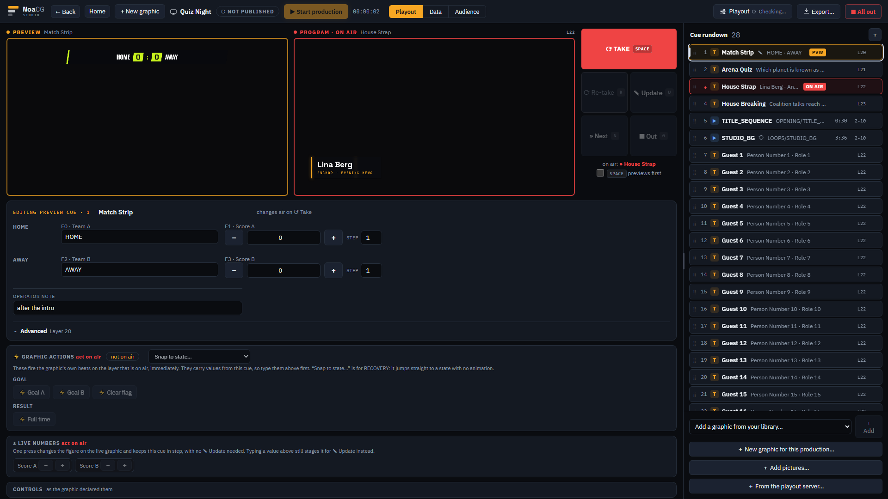
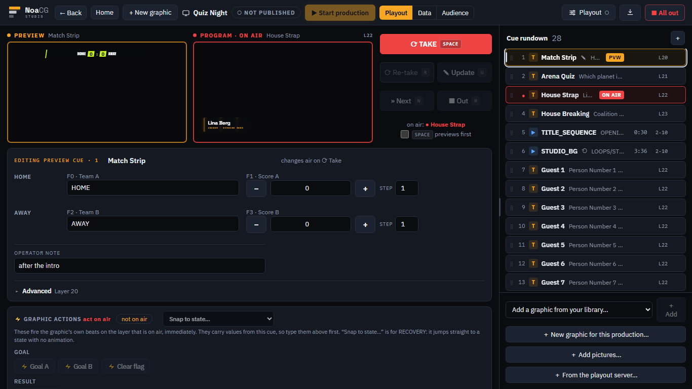
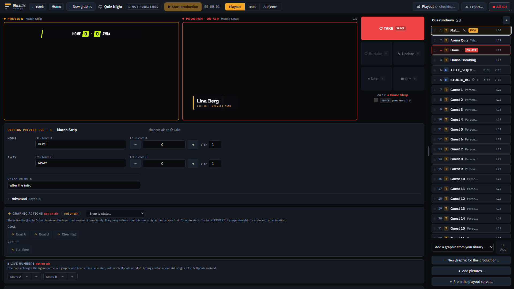
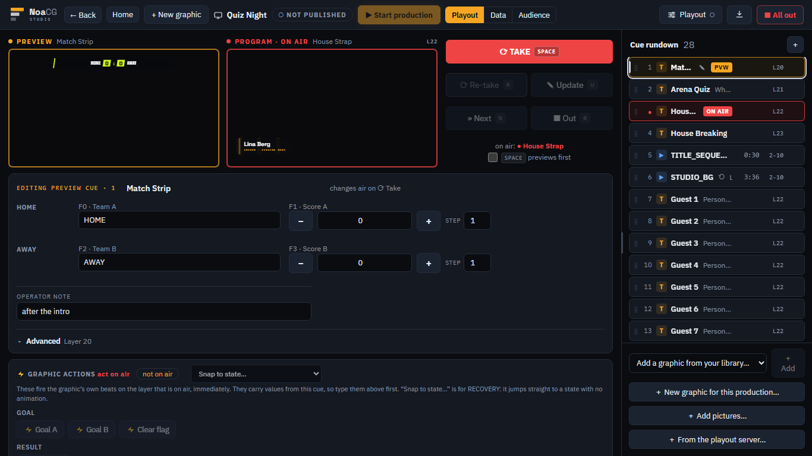
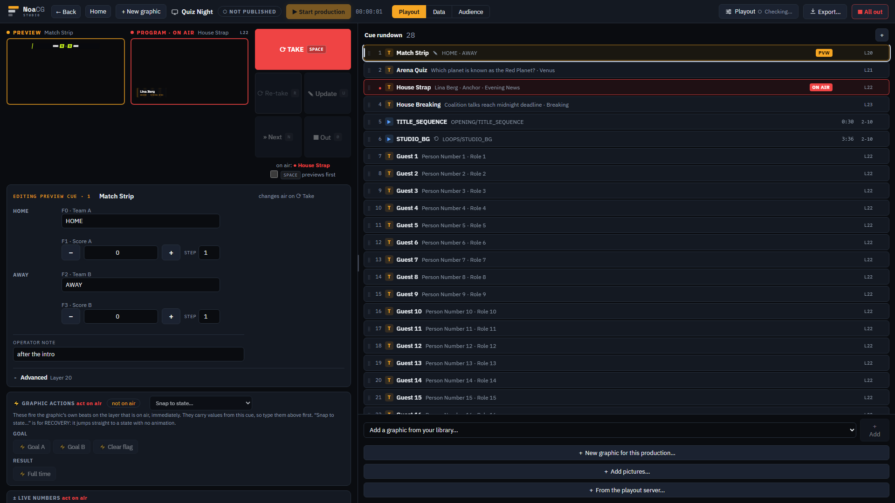
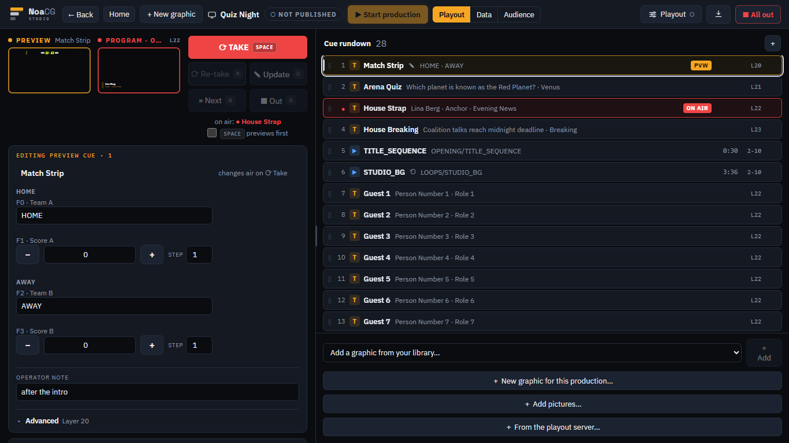
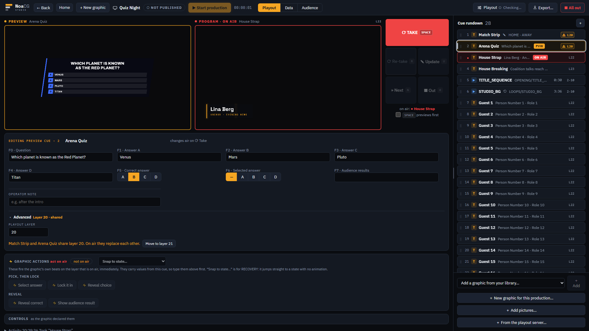

# A rundown you can size, one line a cue

The production page's cue rundown is now as wide as you drag it, every cue is one line, and a
graphic's layer sits under Advanced in its editor. Phase 1 of the clip playback plan
(`docs/CLIP_PLAYBACK_PLAN.md` §6.1, §6.2, §6.5), from branch `claude/phase-1-clip-playback-layout-44eeba`.

## The route, about three minutes

[/app](https://noacg.studio/app) once this has deployed, then open a production with a scoreboard
and a few other graphics (or make one: Productions, New production, add a scoreboard and two lower
thirds from your library). Do it at 1920×1080 and again on a 1366×768 laptop.

1. Drag the line between the monitors and the rundown from as narrow as it goes to as wide as it
   goes. Double-click it to go back. Reload: the width you left stays.
2. Select the scoreboard and watch its fields fold into fewer columns as the rundown widens.
3. Type the same playout layer on two graphics (Advanced, under the operator note). Both rows show
   a ⚠ badge; press one and its repair opens.

**What to look at.** Does the page still read as one calm surface at both sizes, narrow and wide?
In particular:

- **The default width.** You chose 23% of the window (about 440px at 1920, unchanged 380px at
  1366) over the plan's 40%, to keep the 1080p monitors at 343px. Does 440px feel right on first
  open, or would you drag it wider every time?
- **The one-line rows.** About twenty cues show at 1080p where ten did. The kind is a small
  icon (its tooltip names the graphic), the note is a ✎ after the name, and the layer sits at the
  row's end. Is anything you relied on on the old second line now too hard to find?

These frames were taken from the branch before it landed, with the same production at each size:

| | 1920×1080 | 1366×768 |
|---|---|---|
| default width |  |  |
| narrowest (320px) |  |  |
| widest (60%) |  |  |
| a layer clash, its repair open |  | |

On a phone nothing changes but the rows, which are one line at a thumb's height:
[390×844](../../research/clip-playback-2026-09-27/phase-1/390-phone.png).

Everything an agent could check is pinned by `e2e/playout-rail-width.spec.ts` (the handle, the
row table, the clash door, a twelve-field graphic at both sizes, the list following the air) and
`e2e/playout-fixed-panes.spec.ts` (only the control area scrolls, with the rundown narrow and
wide). The look is the part only you can judge.
