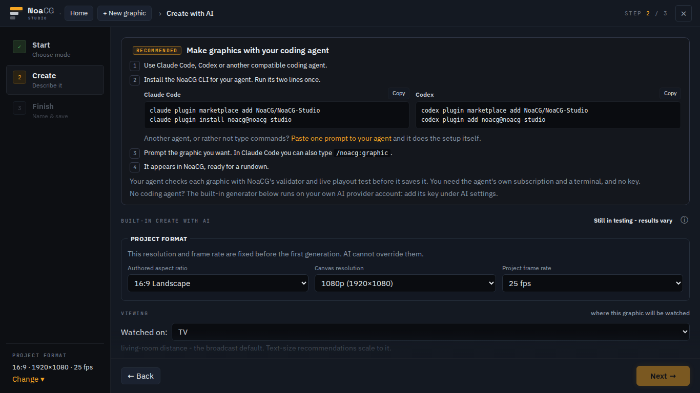
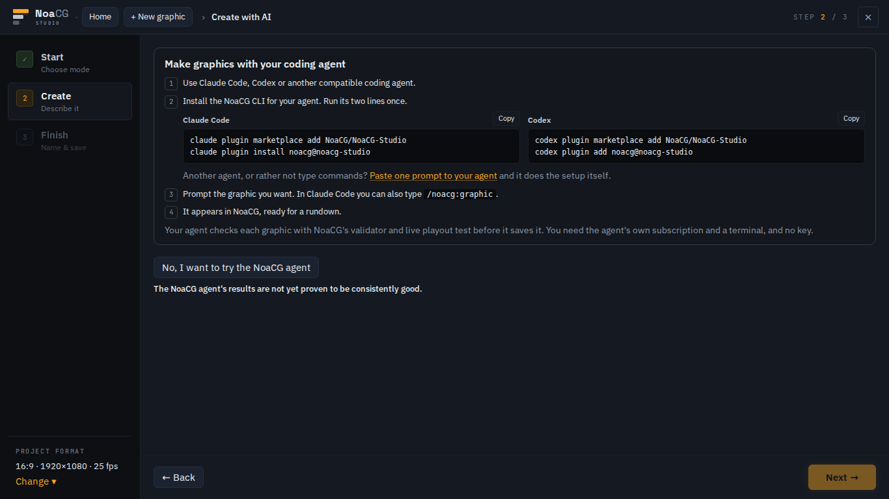
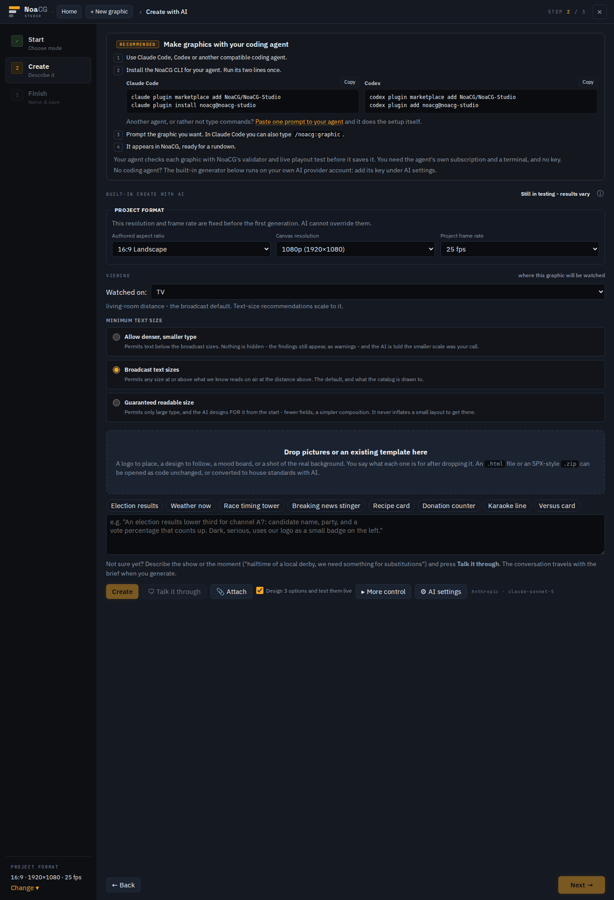
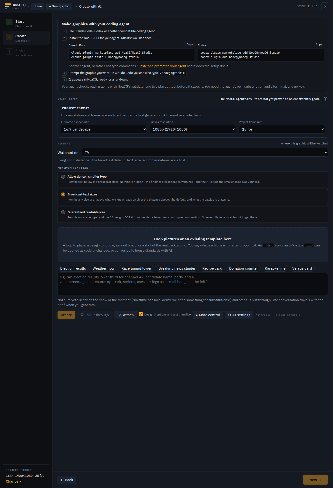

# Create with AI: your coding agent alone first, the NoaCG agent one click away

You said the Create with AI page had too much information. It now opens on **Make graphics with
your coding agent** and nothing else: the four steps, the two install blocks with their Copy
buttons, and the paste-one-prompt link. Under it is one secondary button, **No, I want to try the
NoaCG agent**, with one line in plain body text under that: *The NoaCG agent's results are not
yet proven to be consistently good.* The Beta tag, the "Still in testing" note and the card's
Recommended tag are gone. Pressing the button opens everything the built-in generator had before
(project format, viewing, drop zone, brief, AI settings, results), under a head that says
**NoaCG agent** and repeats the same warning.

A design consult (Fable) settled four things:

- The warning sits **under** the button, not beside it, so it cannot break across a row.
- The warning is in body colour, not grey. A grey line under a grey button would be the same
  "still testing" whisper you had removed.
- The coding-agent card **stays open** after you choose the NoaCG agent, because it is the
  reference the settings sheet's "Show me" jumps back to.
- A picture or template **dropped on the page before choosing** opens the NoaCG agent with the
  file already in it. Otherwise the no-AI "open as code" import would sit behind a button about
  AI.

The choice is not remembered. Every time you open Create with AI it shows the coding-agent route
first, so someone who uses the NoaCG agent every day presses one button each time.

## The route, one minute

<https://noacg.studio/app> once this has deployed, then **New graphic** and **Create with AI**.
Read the first screen, then press **No, I want to try the NoaCG agent**.

**What to look at.** Two things:

- Does the first screen read as *here is the good road* rather than *go away*?
- Is the button wording yours? It is your own phrase: the consult suggested "Try the NoaCG agent
  instead", because "No, …" answers a question the card never asks. It kept your wording on the
  assumption it was meant literally. The warning also keeps "proven to be", which the consult
  suggested dropping.

| | before | after |
|---|---|---|
| arrival at 1366×768 |  |  |
| the whole step |  |  |

Everything an agent could check is pinned by `e2e/ai.spec.ts`. That covers: nothing from the
generator is on the page before the choice, the button fits the laptop screen without scrolling,
the warning is in body colour and is not cut off, focus moves to the opened section, a drop
before the choice lands on the import card, and reopening the step starts at the agent route
again. The rule is `wizard/open-create-step-user-own-coding`.
