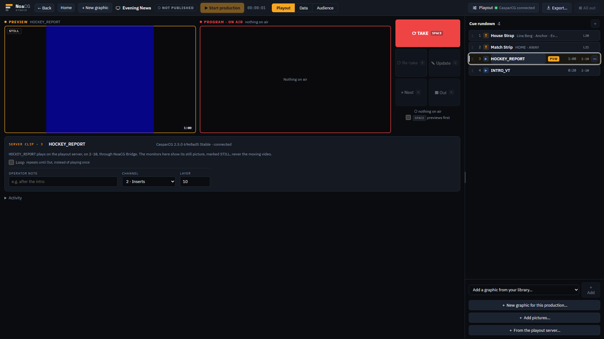
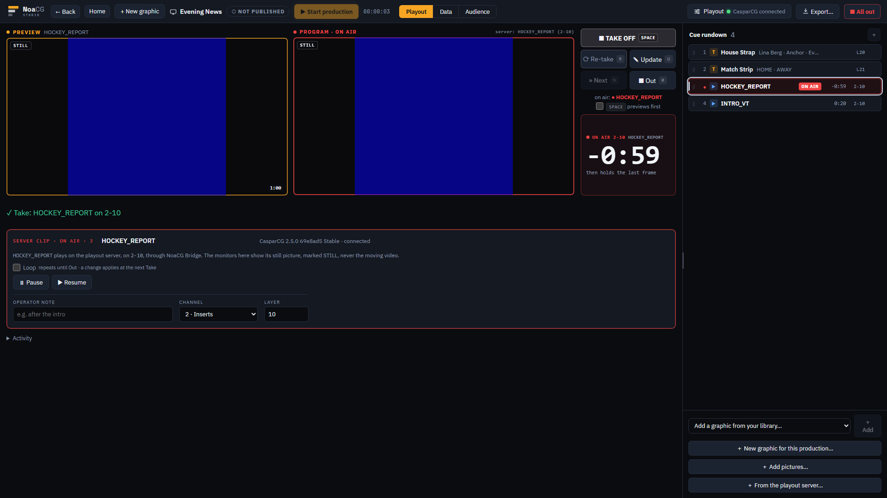
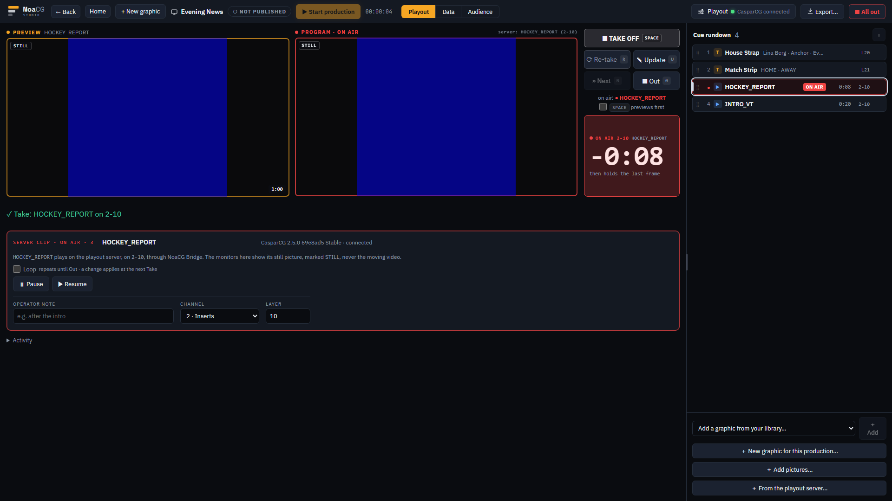
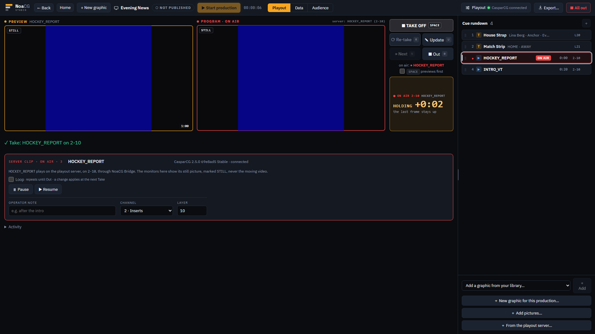
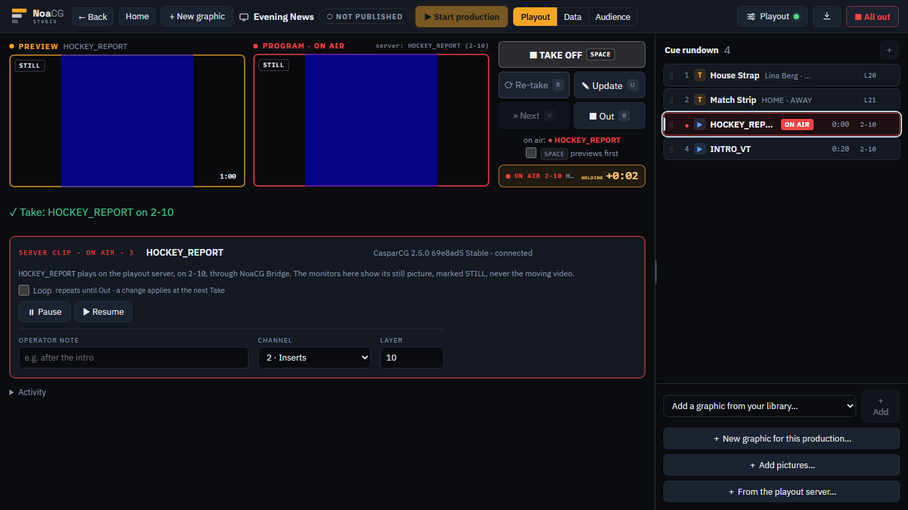
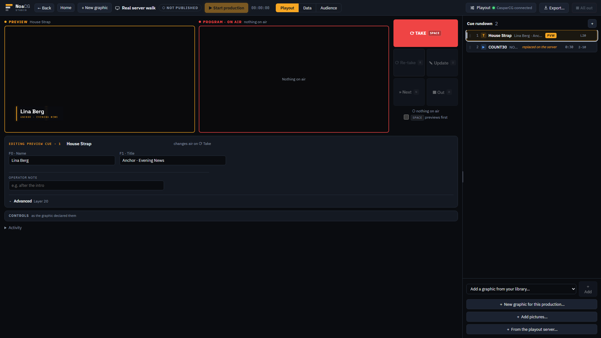

# A countdown for the clip on air, read off the CasparCG server

While a server clip is on air, a clock under the verb buttons counts it down, and the rundown shows
what the server really holds. Phase 2 of the clip playback plan (`docs/CLIP_PLAYBACK_PLAN.md` §6.3,
§6.4, §6.7), from branch `claude/clip-clock-phase-2`, with NoaCG Bridge 0.4.2.

## The route, about five minutes

[/app](https://noacg.studio/app) once this has deployed, with NoaCG Bridge 0.4.2 from the Releases
page running on the laptop and your CasparCG server connected. Open a production with a clip from
the server in its rundown (From the playout server…, pick a clip of about 15 to 30 seconds). Do it
at 1920×1080, then again on a 1366×768 laptop.

1. Take the clip. The clock appears under the buttons: `ON AIR 2-10`, the clip's name, the time
   left, and `then holds the last frame`. The clip's row counts down too.
2. Watch the end. The last ten seconds turn the clock red, the last five pulse it, and at zero it
   turns amber and counts up: `HOLDING +0:01`. Compare it with the CasparCG channel's own output:
   it should reach 0:00 within half a second of the picture stopping.
3. Reload the page mid-clip. The row comes back ON AIR and the clock carries on from the right
   time.
4. Play the same clip on the same channel and layer from the CasparCG Client. The row says
   `replaced on the server` and the clock goes.
5. While a clip plays, watch the channel's output for a stutter or a dropped frame. The page asks
   the server what it holds twice a second; each question took about 1.5 ms on this machine, but
   whether it ever costs a frame on air was not measured.

**What to look at.** Is the clock the number you would count a director out by? In particular:

- **Its size and place.** At 1920 it is a tall box beside PROGRAM; on a 1366 laptop there is only
  room for one thin row, so the `then holds the last frame` line gives way. Is the thin row still
  clear enough from where you sit?
- **The warning.** Red at ten seconds, pulsing at five, amber when it holds. Too loud, too quiet,
  or right?
- **`STILL`.** The monitors show a clip's picture, not its moving video, and a small `STILL` tag
  says so. Does the tag make that clear, or is it noise?

These frames were taken from the branch before it landed. The Bridge was faked for the first seven,
with a 60-second clip; the last is the real 2.5.0 after another client took the clip's slot:

| | 1920×1080 | 1366×768 |
|---|---|---|
| a clip selected |  | |
| on air, counting |  |  |
| the last ten seconds |  | |
| holding the last frame |  |  |
| replaced on the real server |  | |

On a phone the clock is a band under the monitors:
[390×844](../../research/clip-playback-2026-09-27/phase-2/390-counting.png).

Already checked on the real 2.5.0 on this machine (`docs/BRIDGE.md` §8): the clock matched the
server to the second across six samples, the warning, the last five seconds and HOLDING landed on
time, a reload brought the clock back, and another client's take read `replaced on the server`.
A trimmed clip's countdown (the part of the file that plays, not the whole file) is pinned against
the server's own answer; trimming from the page comes with phase 3. Everything else an agent could
check is in `e2e/playout-clock.spec.ts` and `cli/test/state.test.mjs`. The look, and whether the
reading ever costs a frame on your air, are the parts only you can judge.
