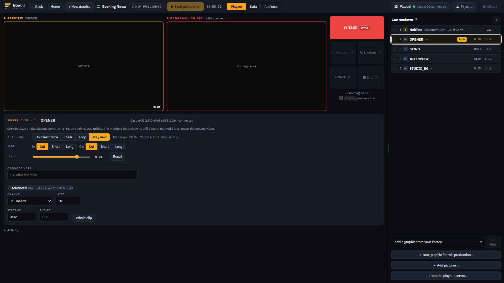
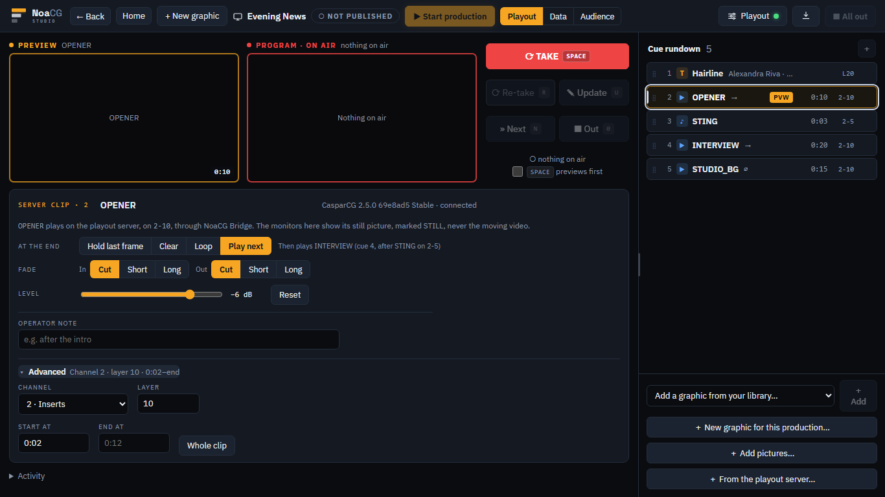
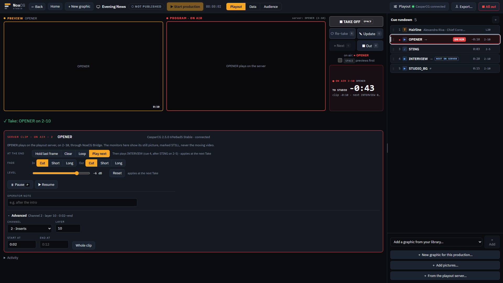
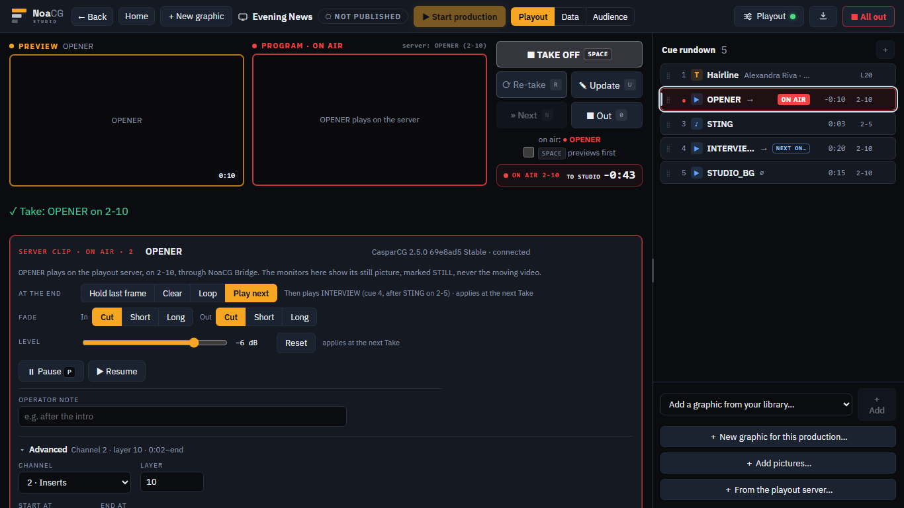
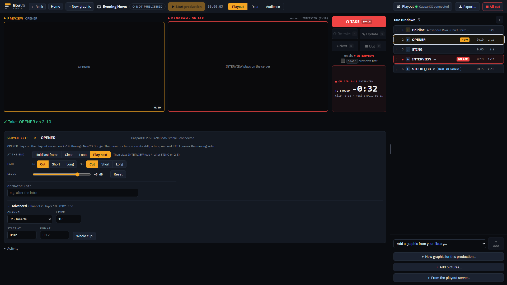
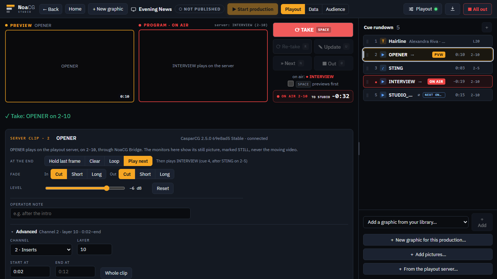
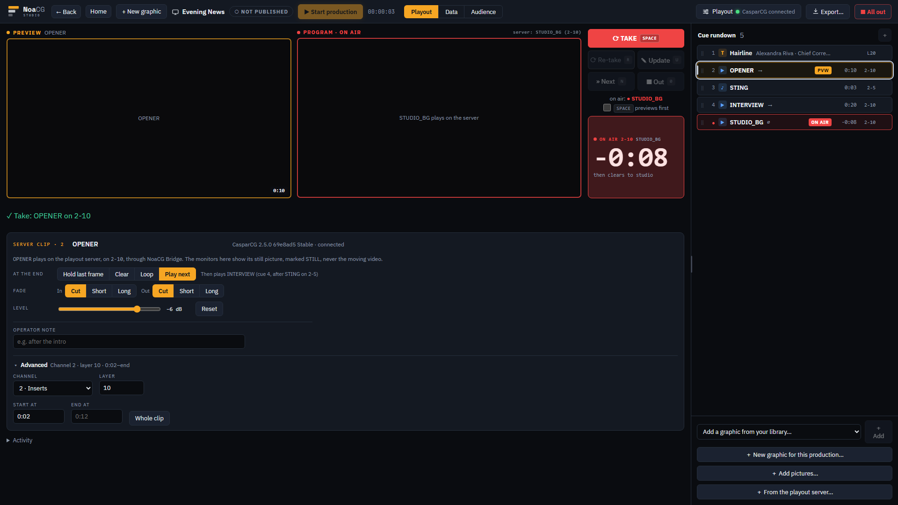
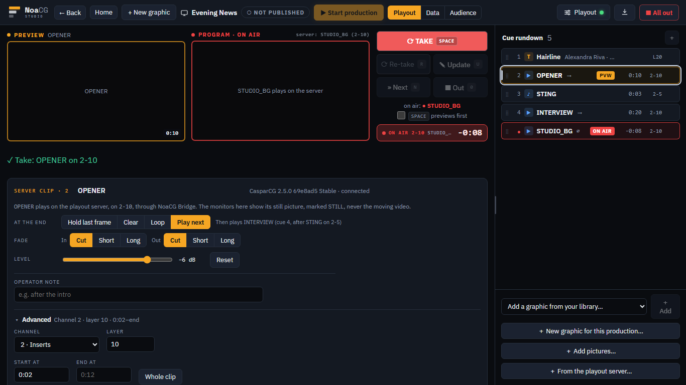

# A clip's settings and Play next, on the CasparCG server

Each server clip now says how it plays: what happens at its end (Hold, Clear, Loop, Play next), a
fade in and out, a level in dB, and where in the file it starts and ends. Clips set to Play next
play one after another, run by NoaCG Bridge, and the clock counts TO STUDIO. Audio files play on
their own layer. Phase 3 of the clip playback plan (`docs/CLIP_PLAYBACK_PLAN.md` §6.4 to §6.10),
from branch `claude/clip-playback-phase-3-f625c8`, with NoaCG Bridge 0.5.0.

## The route, about ten minutes

[/app](https://noacg.studio/app) once this has deployed, with NoaCG Bridge 0.5.0 from the Releases
page running on the laptop and your CasparCG server connected. You need three clips of 10 to 30
seconds and one short sound (a sting) on the server. Do it at 1920×1080, then glance at it on a
1366×768 laptop.

1. **Clear with a fade, with the page closed.** Add a clip, set At the end to Clear and Fade Out to
   Short, Take it, then close the NoaCG tab. The clip should fade out over its last half second and
   leave the layer empty.
2. **A sting over a VT.** Add the sting from the server: its row shows `♪` and `2-5`. Take a clip,
   then take the sting while it plays. The clip must keep playing under it.
3. **The level.** Take a clip at 0 dB, then set its Level to -12 dB and take it again. It should be
   clearly quieter; nothing else on the channel should change.
4. **Play next.** Put three clips on the same channel and layer in the rundown, set the first two
   to Play next (the line beside the choice names the clip each will play), give the second and
   third a Fade In of Short, and Take the first. They should play one after another with no black
   between them. The clock reads `TO STUDIO`, and it should reach 0:00 when the last one ends.
   The rows' ON AIR follows the server down the rundown while your selection stays where it was.
5. **Out in the middle.** Take the three again, and press Out on the clip on air while the second
   one plays. Nothing else should air.
6. **P.** Press P while a clip plays: it pauses, and P again resumes it.

**What to look at.** Is this how you would want to set a clip up under pressure?

- **The settings' place and density.** At the end, Fade and Level are always visible; channel,
  layer and the trim sit under Advanced. Is anything you would change every show hidden, or
  anything rarely touched too loud?
- **TO STUDIO.** Big while another clip follows, with the clip's own time small under it and the
  warning on TO STUDIO only. Is that the number you would count the director out by?
- **The reasons.** When Play next is off, the line says why (`no clip after this one plays on
  2-10`). Useful, or noise when a rundown has only single clips?
- **The rundown at 1366.** A row with an end mark and `NEXT ON SERVER` shortens the tag first
  (`NEXT ON…`) and then the name. Still readable from where you sit?

These frames were taken from the branch before it landed, with the Bridge faked (a 12-second
opener trimmed to start at 0:02, a sting, a 20-second interview and a 15-second studio shot):

| | 1920×1080 | 1366×768 |
|---|---|---|
| the settings, Play next chosen |  |  |
| taken: TO STUDIO |  |  |
| the server switched to the next clip |  |  |
| the last clip's last seconds, then it clears |  |  |

Already checked on the real 2.5.0 on this machine (`docs/BRIDGE.md` §8): the Bridge played a
three-clip sequence with fades and a Clear with no frame of nothing between; a clip trimmed to
start part way in aired every time; Out in the middle cleared the layer and nothing followed; a
refused replacement Take left nothing queued; a Pause held the next clip back until Resume; -12 dB
measured 12.0 dB quieter on a recording, on 2.5.0 and 2.3. Everything else an agent could check is
in `cli/test/runner.test.mjs`, `e2e/playout-cues.spec.ts`, `e2e/playout-sequence.spec.ts` and
`e2e/playout-clock.spec.ts`. The page driving your own server, how it sounds, and the look are the
parts only you can judge.
