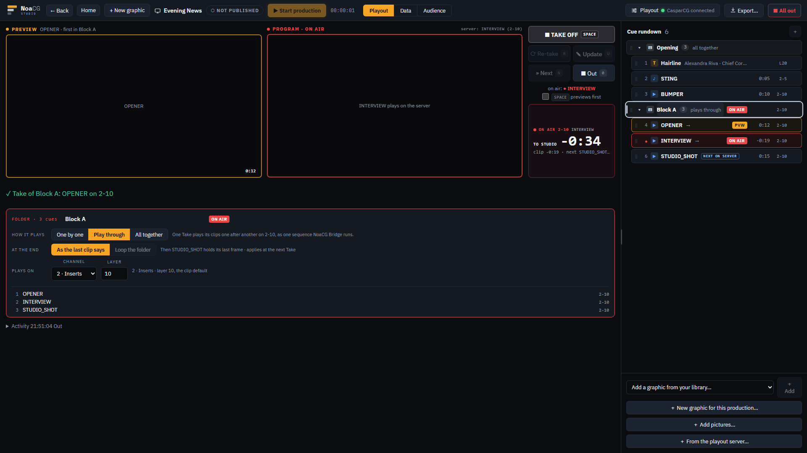
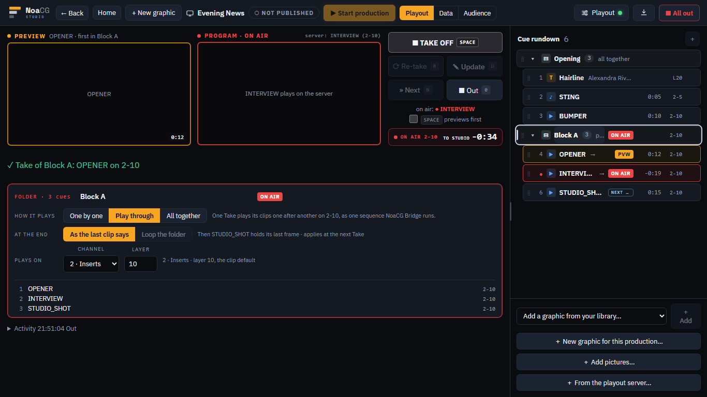
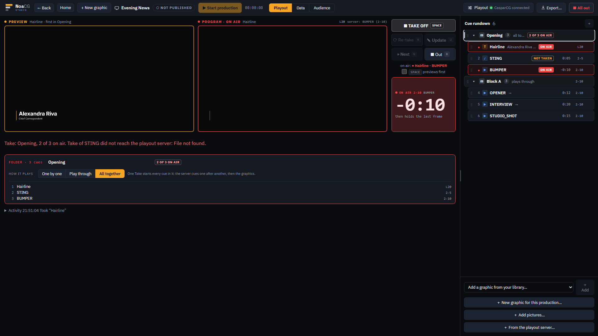
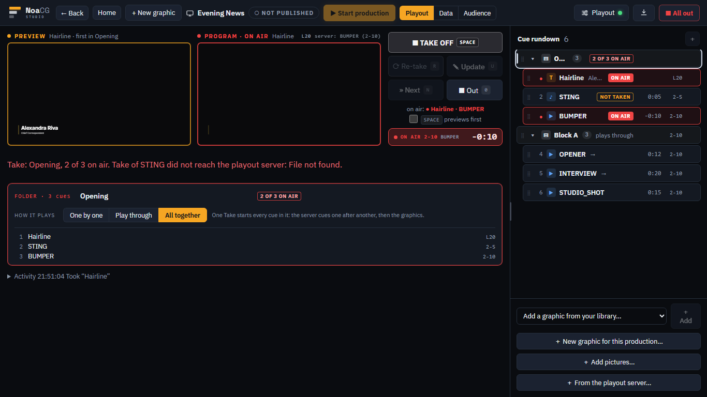
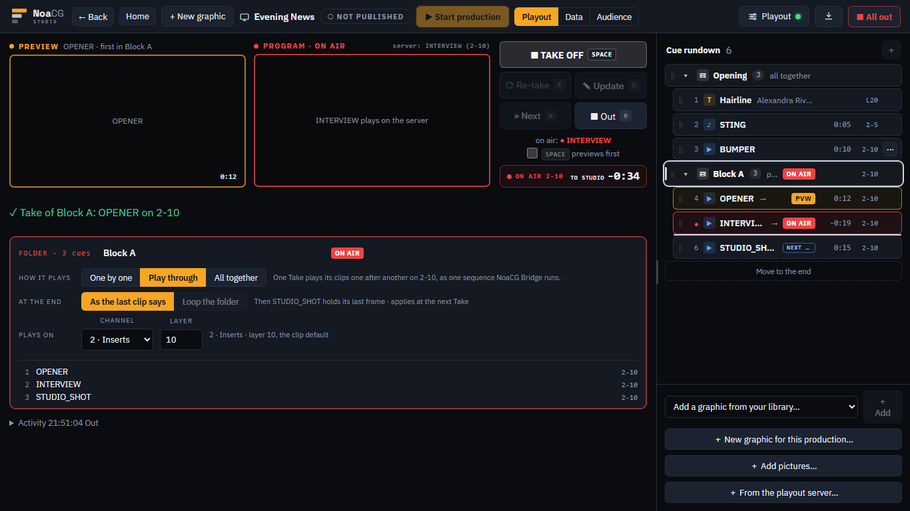

# Folders in the rundown, on the CasparCG server

Cues can now sit in folders on the production page. A folder plays one by one (tidiness only), plays
through (its clips one after another on one layer, from one Take, and with Loop the folder round
again until Out), or all together (one Take starts every cue in it). Phase 4 of the clip playback
plan (`docs/CLIP_PLAYBACK_PLAN.md` §6.2, §6.5, §6.6 and §7), from branch
`claude/phase4-noacg-playout-7b336b`, with NoaCG Bridge 0.6.0.

## The route, about fifteen minutes

[/app](https://noacg.studio/app) once this has deployed, with NoaCG Bridge 0.6.0 from the Releases
page running on the laptop and your CasparCG server connected. You need three clips of 10 to 30
seconds, a video that has its sound in a separate audio file, and a graphic. Do it at 1920×1080 with
a real mouse, then glance at it on a 1366×768 laptop.

1. **Make a folder.** Click the first of the three clips, shift-click the third, and press
   `▤ New folder` in the bar under the list. The header appears above them with the clips indented
   under it. Click the header: its panel opens where a cue's editor would be.
2. **Play through.** In the panel set How it plays to Play through (Plays on reads layer 10 on the
   clip channel) and press SPACE. The three should play one after another with no black between
   them, ON AIR moving down the rows while the header stays held.
3. **Loop the folder.** Set At the end to Loop the folder and take it again. After the last clip the
   first should follow with no black, round and round, until Out on the header stops it. Leave it
   looping for two rounds.
4. **All together.** Make a second folder of the video and its audio file (and the graphic), set it
   to All together and press SPACE on its header. The picture and the sound should start together:
   on this machine the server started the audio within one frame of the video on 2.5.0 and within
   two on 2.3. Listen for any lip-sync slip. Out on the header takes all of it off.
5. **Drag.** Drag a clip into a folder and out again, and a whole folder by its header. The line
   shows where it will land: the middle of a row moves it as before, the top or bottom third puts it
   before or after that row inside its folder. Try to drop the graphic into the Play-through folder:
   it is refused, with the reason under the list.
6. **Collapse and keys.** Collapse a folder with ▾, walk the rundown with the arrow keys, and take a
   cue from the keyboard. A collapsed folder is one step, and its header lights when a cue in it goes
   on air.

**What to look at.** Is this how you would build and run a show block under pressure?

- **The drop zones.** Each row is split into thirds of about 11 pixels. Do drops land where you
  expect with a mouse, or does the line jump?
- **Collapse is saved with the production**, so a teammate sees your folders collapsed too. Right,
  or should it be your own view only?
- **The list follows the air.** A looping folder scrolls the list to each new clip unless it is
  collapsed. Useful, or restless?
- **Duplicate now goes right after the cue it copies**, everywhere, where it used to go to the end
  of the rundown.
- **The header row at 1366.** The name keeps its place; how it plays shortens first (`all to…`).

These frames were taken from the branch before it landed, with the Bridge faked:

| | 1920×1080 | 1366×768 |
|---|---|---|
| a Play-through folder held, on its second clip |  |  |
| an All-together folder, the server refused the sting |  |  |
| a clip dragged to the end of the Play-through folder |  |  |

Already checked on CasparCG 2.5.0 and 2.3 on this machine (`docs/BRIDGE.md` §8,
`docs/CLIP_PLAYBACK_PLAN.md` §12 items 8, 11 and 12): the Bridge looped three 3-second clips through
two wraps with no black at any switch, a trimmed clip in the loop played its own segment each lap,
nothing was queued early after the server switched into a trimmed clip, and a video and its own
audio file taken one after another started within a frame or two. Everything else an agent could
check is in `e2e/playout-folders.spec.ts`, `cli/test/runner.test.mjs` and the Node tests of the
record. The page driving your own server, how the sync sounds, and how the folders feel to build
are the parts only you can judge.
