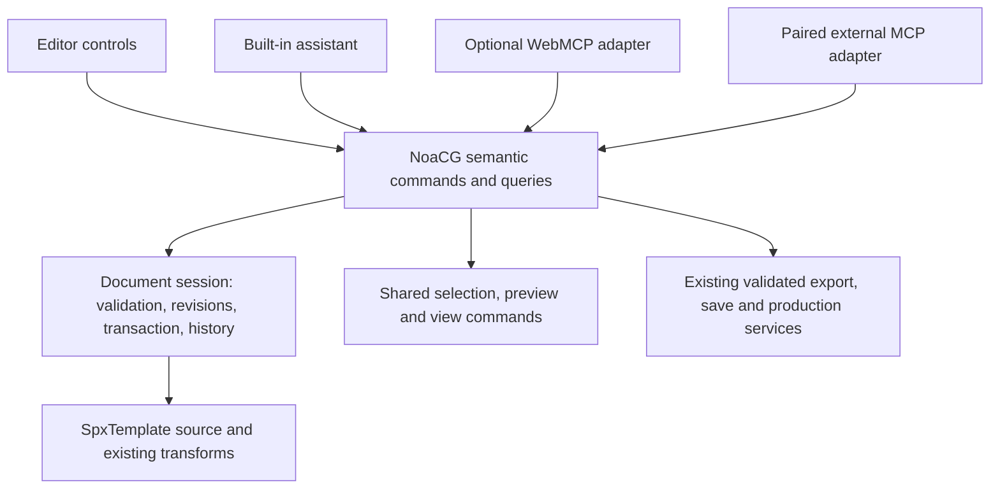

# Semantic editor commands and optional WebMCP

2026-09-19. Owner request: assistants should understand the current graphic and execute the
same meaningful actions as the UI, without navigating controls. Decision: extend the existing
command/session foundation and add WebMCP as an optional adapter after R1.3b. This is planning
and source inspection, not a claim that the full action surface or browser adapter is built.

## Existing implementation: reuse, not replacement

Inspected merged foundation at origin/main 15b8f3fc, including the R1.1a handoff. The planning
branch predates those commits; the source inventory here describes merged code, not that older
checkout. Recheck the consuming slice because R1 authoring work is actively progressing.

| Existing code | What it already provides | Remaining work |
|---|---|---|
| src/components/editorFoundation/operations.ts | Pure source operation pipeline, bounded batches, source/target validation, patch and changed-target result. Reuses animEdit. | Registry currently contains ONLY key.set on existing supported numeric tracks. It is not a complete layer/style/animation API. |
| src/components/editorFoundation/session.ts | DocumentPort, source/asset revisions, document ID, transaction identity, gesture preview/cancel, one source commit, undo/redo and disposed-session refusal. | Runtime tool schemas, caller policy, structured receipts/errors, cancellation and interleaving semantics need integration. Duplicate IDs are refused, not replayed idempotently. |
| src/components/editorFoundation/documentAdapter.ts | Binds the active working document/store to a session and disposes the previous session. | Still one working slot; independent saved GraphicDoc ports remain R1.4a. A reopen needs a session-generation identity, not only saved graphic ID. |
| src/components/editorFoundation/EditorFoundation.tsx; timelineView.ts; src/model/structure.ts | Shared canvas/timeline selection, source-derived hierarchy/timing, session undo and scrub. | Selection/seek are currently UI closures/store calls. Extract their reusable view commands when another consumer needs them. Source revisions alone do not guard selection/playhead changes. |
| src/components/editorFoundation/PreviewController.ts; protocol.ts | Revision/window/generation-aware preview readiness and seeks. | Reuse for preview receipts; an accepted source transaction is not proof that its pixels were displayed. |
| src/blocks/edit.ts; registry.ts; designLayout.ts; designFields.ts; assetOps.ts; animEdit.ts; presetApply.ts | Source transforms for fields/text, placement/style, blocks, assets and animation. | Reuse behind supported semantic operations. These helpers have differing source assumptions and are not automatically safe for arbitrary SVG/catalog documents. |
| src/ai/provider.ts; src/components/AIPromptPanel.tsx; src/ai/pro/harness/tools.ts | Existing generation/change proposals and an AI design workbench/harness. | Neither is a complete live-editor tool service. R1.3b should call the shared edit path instead of introducing another mutation engine. |
| src/bridge/bridgeApi.ts; cli/src/mcp.ts | CLI/MCP already invoke platform scaffold/inspect/validate/export services through the bridge. CLI exposes a compact noacg dispatcher. | The stateless bridge receives package bytes; it does not know a user's open editor/selection/history. R3.2 still needs explicit live-document pairing. |
| src/export/registry.ts; src/community/gate.ts; existing save/production services | Export targets, validation and publishing foundations. | Wrap application services with clear effects and permissions; do not reproduce them in WebMCP callbacks. |

Answer: most of the architectural foundation and many editing primitives exist. Most of the
requested semantic tool vocabulary is not yet implemented in the new registry. Grow it with
the UI slices and their tests; exposing old helpers directly would bypass the new guarantees.

## Current Google implementation and specification

Google's public guide describes an origin trial from Chrome 149 and a local development flag,
chrome://flags/#enable-webmcp-testing [S1]. The September 17 specification is a Draft Community
Group Report, explicitly not a W3C Standard or Standards Track document [S2]. Treat browser
availability and API shape as experimental; do not require it for the editor or built-in AI.

The current imperative interface is document.modelContext: registerTool, getTools and
executeTool. Registration uses a name, description and JSON input schema; AbortSignal handles
registration lifetime and execution cancellation. Chrome documentation distinguishes unregistration
from in-flight cancellation from Chrome 153 and deprecates stringified executeTool inputs from
155 [S3]. Earlier navigator.modelContext/provideContext/clearContext examples are obsolete
relative to current guidance [S4]. Check the exact browser build/API at the future spike;
a property existing is not a full interoperability test.

WebMCP also offers form annotations. NoaCG's canvas is better served by the imperative API
because its meaningful operations already live in TypeScript. Use native feature detection and
no-op registration when absent; no polyfill or React hook package is needed to keep the core
architecture open. Keep browser-specific signatures in one adapter. Do not promise automatic
Claude Code/Codex access: that requires a compatible browser client/bridge. External MCP remains
a separate transport and the existing CLI remains useful without an open editor [S1, S3].

Secure-context/origin-isolation and the tools Permissions Policy constrain availability.
Register on the trusted editor shell, not generated graphics or their sandboxed preview frames.
Do not enable cross-origin tool exposure for the graphic runtime. Origin isolation here is not
a reason to impose crossOriginIsolated/COOP/COEP throughout NoaCG. Recheck actual eligibility in
the selected browser. The origin trial/extension account setup is not needed for this research.

## Shared command ownership

Use a small command catalog with shared input validation, supported-target checks, handler and
side-effect classification. Derive transport schemas/descriptions from that catalog where
practical. The UI calls its handlers directly; it does not call browser tools to edit. Built-in
AI does not depend on WebMCP availability. WebMCP/MCP callbacks decode, authorize, dispatch and
encode results; they contain no editing algorithms, DOM clicking or independent scene state.

Source mutations remain deterministic template-to-template patches through EditorSession.
Queries, selection and preview are separate from source history. Export/publish are application
jobs with their own receipts, not fictitious source edits. This is one semantic surface over
existing services, not one giant transaction abstraction pretending every action is reversible.

When a second consumer actually imports the registry, relocate transport-neutral modules out
of components/editorFoundation if needed and re-export temporarily for the UI. Do not create a
second registry because of the present folder name, or build a generic plugin framework now.

### Meaningful action families and delivery

Illustrative names below are vocabulary proposals, not a frozen public API. Expose only actions
whose underlying UI behavior and source-preservation tests pass. Several families can share one
batch command internally; the CLI may retain its compact dispatcher instead of multiplying tools.

| Action family | Meaning / shared implementation | Delivery owner |
|---|---|---|
| inspect_editor, inspect_layers | Document/session/revisions, source-derived layer IDs/hierarchy, selected IDs, playhead/cue, effective versus base values, supported operations, field links and preview status. Page/filter details. | R1.3a bounded context, R1.3b query contract; reuse R1 foundation readers |
| select_layers, preview_graphic | Select explicit stable IDs; seek/rehearse locally and return the matching preview receipt. No on-air playout. | Reuse R1 view/preview handlers when adapter is added |
| create_layer, delete_layers, set_layer_text | Create supported text/shape/image layers; update text without losing fields; deletion checks dependants and unknown source. | R1.1a creation/base edits; R1.2b full organization/deletion |
| set_layer_style, transform_layers, align_layers | Typed style properties/units, font/content fit, parent/layout coordinates, base versus keyed edit mode; multi-target alignment in a declared space. | R1.1a core, R1.2a/b complete controls |
| add_asset | Use an existing validated asset ID or an explicit import workflow; preserve SVG wizard mapping. No arbitrary local filesystem path access from a web tool. | R1.2b assets and existing wizard/import services |
| apply_animation | Apply a supported preset or bounded keys at explicit times/cues, with normal In/hold/Out and easing semantics. No invented durations or alternate AI timeline. | R1.1b/c core, R1.2 richer animation |
| bind_data_field | Bind an eligible property to a declared field/path, preserve wizard exclusions and typed mapping. Separate author defaults, sample data and live values. | Existing simple field helpers; R3.1 structured data |
| undo_edit, redo_edit | Use the same history, with expected history head/session/revision so a delayed tool cannot undo a newer human edit. | R1 session plus R1.3b concurrency policy |
| export_graphic, publish_graphic | Distinguish package generation from library save, rundown installation and public publication. Reuse each service's validation, target/destination and authorization. | Existing export services, R1.4 handoff, R3.2 paired integration |

Prefer typed set_layer_style over one tool for each inspector control. Do not expose arbitrary
JavaScript/eval, CSS selectors, store setters or postMessage wire details as the normal tool API.
Use source-owned layer IDs mapped internally to selectors; mint unnamed SVG IDs through the
existing first-edit contract. Unknown source is preserved and unsupported operations are refused.

## Reliability and context contract

- An inspection returns a bounded snapshot: document ID, session generation, source/asset
  revision, selection/playhead context token, capabilities and preview readiness. Layer text
  and imported/live data are content, not instructions. Return relevant subsets, not all source
  or asset bytes by default; keep credentials and unrelated projects out of tool responses.
- Edits name explicit layer IDs, expected document revision, transaction ID, and base/keyed
  mode plus time/cue when relevant. Resolve 'selected layers' once against the inspected context;
  never re-read whatever happens to be selected after a model/network delay. Reject a stale
  selection/playhead token when it influenced intent. A reopened document has a new session token.
- Validate the complete batch and build the deterministic patch before one commit/undo entry.
  Registry validators enforce property units, bounds, ownership and dependencies independently
  of JSON Schema or TypeScript. Invalid final operations leave earlier operations unapplied.
- Existing gesture previews stay transient. Refuse/defer agent writes during a human gesture
  through a shared policy, then re-inspect; do not silently cancel the user's drag. A previewed
  AI proposal is applied only to the revision it reviewed, following the R1.3b review contract.
- Return structured outcomes: changed IDs, transaction and new revision, supported warnings,
  preview status, and stable error categories such as stale_context, unsupported_target,
  invalid_input, busy, cancelled and validation_failed. Never report visible success before a
  matching preview acknowledgement; report committed-but-preview-failed honestly when necessary.
- R1 currently rejects duplicate transaction IDs. Before transport retries, define a bounded
  receipt lookup: same session/ID plus identical payload returns the existing outcome; changed
  payload is refused. Do not silently retry a write after a lost response with a new ID.
- Cancellation before commit leaves source untouched. After commit, cancellation reports the
  commit receipt rather than claiming rollback or undoing subsequent user work. Unregistering
  tools on navigation is separate from cancelling in-flight work; check session liveness again
  immediately before commit. Revoke exposure on close/unmount and avoid duplicate registrations.
- Browser annotations are hints, not application authorization [S5]. Classify read, reversible edit,
  export and external effects in our catalog. Reuse existing confirmation/permissions for
  publishing or installation and bind approval to exact revision/target/destination; model-supplied
  approved=true is not proof. Existing live playout is not made reachable by editor preview.

These are transport readiness requirements, not claims that R1.0 already implements them all.
They extend the existing B17/B18 stale/undo/cancel/selection tests rather than replace them.

## Delivery and prototype decision

1. **Current R1 authoring slices:** add each semantic mutation to the existing registry while
   building its UI; preserve pure transforms and source/history contracts. Close that operation's
   tests with its slice. This is the useful work regardless of browser standards.
2. **R1.3a/b:** bounded inspect context, shared command descriptors/runtime validation and built-in
   assistant dispatch; add receipts/concurrency policy needed for asynchronous callers. Existing
   gateway/AI evaluation and source round-trip remain the owners. No new model/auth system.
3. **P-WEBMCP.0, optional after R1.3b:** local, feature-detected adapter qualification using a
   pinned Chrome build. Start with inspect_editor and one already-proven reversible command,
   such as set_layer_style, plus undo. Test through native WebMCP and compare with direct dispatch.
   Register only the relevant supported subset on the active editor route. Adapter failure must
   leave ordinary editing and built-in AI working. Revalidate the current spec before code.
4. **P-WEBMCP.1:** expand to already-shipped command families if the spike passes; transport
   schema/version mapping stays isolated. **R3.2** adds explicit paired external MCP with origin,
   session, document and permission boundaries over those same handlers. Package CLI workflows
   stay independent. No automatic pairing based only on being on the same machine.

**No runtime prototype now.** Only key.set is in the merged registry and the next authoring
slice is underway. A parallel bridge would either advertise unsupported actions or add temporary
policy around a harness-only mutation. The command mapping and B21 fixtures are the useful,
low-risk preparation. No browser flag, trial, SDK, port or tool registration is added by this change.
WebMCP is optional and does not gate R1 adoption or any supported output host.

### B21 optional adapter acceptance (unverified)

- Same input through UI/built-in dispatcher/WebMCP (and paired MCP when available) produces
  identical source patch, affected IDs and one undo entry; preview at the same time agrees.
- Text/color change and two-layer alignment journey uses semantic calls with no click/selector
  automation; unsupported imported source is preserved with an actionable refusal.
- Malformed schemas/values, mixed valid+invalid batch, stale selection/revision, simultaneous
  human drag, duplicate transaction, lost reply, cancellation and document reopen cause neither
  partial writes nor unintended edits. Undo cannot remove a later unrelated human edit.
- Native browser tool registration, discovery, execution, unregister and in-flight cancellation
  are tested on a named Chrome build. A mock adapter proves only our dispatch, not browser support.
- No-API and policy-disabled browsers retain UI/built-in AI; navigation/unmount cleans up tools.
  Generated preview/export packages contain no tools, tokens or registration adapter.
- Export validates the requested target; publication/install requires its real application
  authorization and revision/destination checks. Editor preview never triggers live hardware.
- Real-model evaluation separately records whether the agent selects the right command and
  understands unsupported results. A deterministic transport test alone does not prove that.

## Primary references

S1. [Google WebMCP guide, updated August 7](https://developer.chrome.com/docs/ai/webmcp).
S2. [Draft Community Group Report, September 17](https://webmachinelearning.github.io/webmcp/).
S3. [Google imperative API, updated September 11](https://developer.chrome.com/docs/ai/webmcp/imperative-api).
S4. [Google Chrome modern-web guidance](https://github.com/GoogleChrome/modern-web-guidance/blob/main/skills/modern-web-guidance/guides/webmcp/agentic-javascript-tools.md).
S5. [Google tool-security guidance, updated September 1](https://developer.chrome.com/docs/ai/webmcp/secure-tools).
Local evidence: merged R1 source files listed above, [foundation implementation inventory](https://github.com/NoaCG/NoaCG-Studio/blob/15b8f3fc/docs/research/editor-r1-foundation/implementation.md), [mechanisms](../EDITOR_REBUILD_PLAN.md), [acceptance register](editor-acceptance-register-2026-09-17.md), and [CLI architecture](../AGENT_CLI.md). The foundation inventory is on main; this planning branch's older base does not contain it yet.
