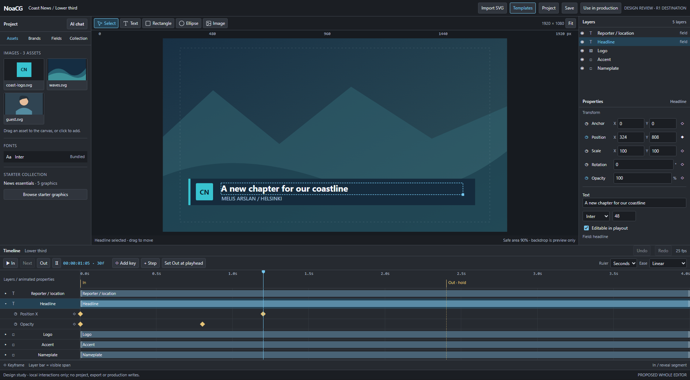
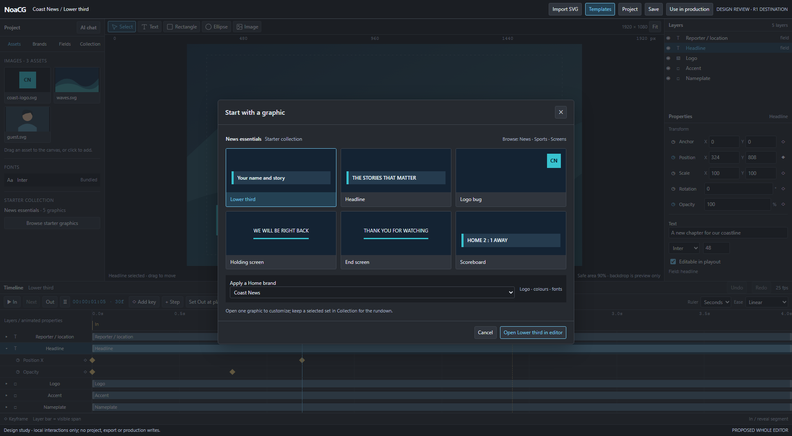

# Whole-editor destination and review

Follow-up: the owner accepted this overall direction. The [workflow refinements](../editor-workflow-review-2026-09-19/README.md) now supersede its fixed Layers dock and add graphic tabs, Pen, imports and expanded easing; this original study remains review history.

2026-09-19. Design review before R1.0. This is a proposed workspace, not the shipped editor.
[EDITOR_PLAN.md](../../EDITOR_PLAN.md) remains the single scope and sequence authority.
The owner requested this whole view before implementation; implementation has not started.
This study supersedes earlier screenshots for the overall layout, permanent Out flag,
Set Out wording, Project Assets and visible starter-template entry. It does not replace
the source, runtime or acceptance contracts with the study's simplified JavaScript.

## One workspace, three ways to start

1. **Existing artwork:** Illustrator SVG -> existing import wizard -> Finish -> optional
   Open in editor. Preserve the generated document, groups, fields, assets and behavior.
   Direct Add to production remains the primary wizard route. Do not rebuild the wizard.
2. **A ready-made design:** Templates -> one graphic or Starter Collection -> Home brand ->
   editable copy in this workspace. Change the content, logo, colours, fonts and layout.
   The first coordinated collection contains lower third, headline, logo bug, holding and
   end screen. Other catalog categories remain available; the study's scoreboard is a
   category example, not a sixth promised design in that first collection.
3. **Your own design:** existing New graphic / blank entry -> this same workspace -> Text,
   Rectangle, Ellipse and Image tools. A new layer immediately exists in the composition
   tree and timeline. Blank creation does not bypass the wizard's existing entry rules.

No separate template editor and no separate animation application are proposed.

## Where each job happens

| Area | What the user does | Why it exists |
|---|---|---|
| Project, left | Find reusable images/fonts, Home brands, operator fields and collection items; open AI chat in this dock | Resources and package work stay reachable without covering the canvas |
| Canvas, centre | Select, drag, draw text/shapes, position images and scale with handles; Fit/zoom/pan and safe areas | Directly manipulate the graphic the audience will see |
| Canvas toolbar | Select, Text, Rectangle, Ellipse, Image; Shift constrains square/circle | Familiar drawing tools, without inspector-only creation |
| Layers, upper right | Inspect composition hierarchy and stacking; select, rename, reorder, lock and group | Manage actual objects, independently of unused project assets |
| Properties, lower right | Anchor, Position, linked/unlinked Scale, turns/degrees Rotation, Opacity; text/shape/image settings | Precise edits and a clear view of the selected object's values |
| Timeline, bottom | Edit the same layers' spans and property keyframes; scrub, key, ease, move, trim, Step and Out | Timing is visible and directly editable, rather than a list of duration forms |
| Templates, top | Browse previews, choose a starter graphic and apply a Home brand | Start from usable broadcast designs, not a blank screen |
| Use in production, top | Review selected graphics and destination rundown, install and rehearse | Finish the artwork-to-production journey with explicit operator control |

**Assets are reusable resources. Layers are placed objects. Timeline rows are those same
objects over time.** Placing a resource creates a layer and its bar; it does not create a
second independent timeline object. New layers begin at the playhead, respecting cue-side
rules. Project assets can remain unused. Imported SVG artwork stays structured where supported.

New authored text is editable in playout by default, with a stable public field ID. Users
can mark it decorative. Reopening imported work preserves the wizard's exclusions and
existing driven fields. Outlined Illustrator lettering remains paths, not editable text.

## The timeline is a working editor

The target is an After Effects-familiar 2D workflow, not full After Effects equivalence.

- Expand a layer to its property rows. Stopwatch arms that property and inserts the first
  key; moving the playhead and dragging the object or editing its value creates the next.
  Unarmed properties change their base value. Diamond adds/removes a key at the playhead.
- Layer bars show visibility. Drag the body with its keys; trim an edge without retiming
  or deleting hidden keys. Cross-cue visibility uses the accepted per-step span contract.
- One playhead scrubs the canvas. Seconds/frames refer to the same document FPS. The
  sample uses 25 fps: 1 second is 25 frames. A hold is indefinite in playout, not a long key.
- Out always exists. Set Out at playhead places the boundary after the entrance. If the
  exit has no keys, a prompt beside that button offers editable reverse keys or manual Out.
  Take plays In and holds; Out plays the exit. Early Out starts from the live pose.
- Add Step places another trigger boundary. Next runs the following segment, then holds.
  New layers can start at that boundary. Groups/folders keep multi-reveal graphics legible.
- Groups in R1.2b have a transform, parent bar and local ruler. Reusable instanced
  precompositions are a separate required task, P-COMP after R1.5.

The main picture uses the first simple In/Out graphic, so it intentionally shows no Step
or group yet. It shows X and Opacity expanded, not the complete list of animatable properties.
The full property contract remains in [the mechanism](../../EDITOR_REBUILD_PLAN.md).

## Each phase must produce a useful outcome

These are bounded implementation slices and review checkpoints, not a promise to finish R1 by
any particular date. Wizard and catalog work stays priority one.
The optional editor demo uses only a verified slice. Feedback can change later designs;
the following user outcomes and existing-document preservation cannot be traded for a screenshot.

| Slice | Why we do it | Concrete closing demonstration |
|---|---|---|
| R1.0 | Establish trustworthy source-backed editing foundations before adding gestures | Open a real graphic on the flagged preview route; canvas/tree/bar selections agree; scrub; reject stale preview revisions; measure latency and exercise history/registry |
| R1.1a | Make small useful corrections after the wizard without rebuilding a graphic | Open the wizard result; move an existing layer; add text/rectangle/ellipse; scale; undo; preserve fields and behavior |
| R1.1b | Let designers author motion directly | Key an off-canvas position, advance 1 second, drag into place; inspect the second key; move the layer bar with its keys |
| R1.1c | Complete the first broadcast animation, including real output | In -> indefinite hold -> reverse/manual/empty Out; early Out without a jump; undo/save/reopen and exported playback agree |
| R1.1d | Prove usefulness on actual Illustrator and catalog work | Edit nested transformed artwork and catalog flow; trim without retiming; preserve IDs/fidelity; two first-time users complete the task |
| R1.2a | Support deliberate motion and multi-stage reveals | Full 2D key gestures/easing; named Step/Next; exact cue-side edits and curve splits after the shared Bezier gate |
| R1.2b | Make everyday graphic construction and organization practical | Typography/fit, asset replacement, image tools, duplicate/delete/reorder/align/distribute; folders/bins and group transforms/local ruler |
| R1.2c | Keep held graphics animated safely | Local loops seek backwards deterministically, exit during motion, then replay correctly |
| R1.3 | Make AI and the CLI useful collaborators on the same document | A grounded answer and bounded edit use registered operations; undo/conflict handling and CLI round-trip work with a real model |
| R1.4 | Let a stream get a coherent graphics package into production quickly | Choose a starter set, apply a Home brand, override one item, install a subset, retry safely and rehearse; can run from R1.1c once the registry is stable |
| R1.5 | Replace the old editor only when the new workflow earns it | Meet acceptance/latency/comparative and named receiving-host checks; settle GSAP obligations; owner reviews the default switch and retirement evidence |
| P-COMP | Reuse motion designs without copying unrelated documents | Edit a reusable definition/instance and verify fields, history and exports after R1.5 |
| R2.1 / R2.2 | Expand graphic expression after basic editing works | Lottie playback/loops first; then editable gradients, masks and composable effects |
| R3.1 / R3.2 | Handle richer data and external live co-authoring | Structured GDD/arrays/runtime collections; then a paired revision-safe MCP workflow |

Each slice's task begins with **user problem -> outcome -> preserved behavior -> operation
and module boundaries -> closing test -> owner review route**. A list of controls is not
an implementation brief. Link the existing E/B acceptance IDs; do not create another checklist
that can be declared complete while those remain open.

## Keep the codebase coherent

Before R1.0 code changes, record a concrete file-level keep/refactor/replace/retire inventory
and the removal owner/slice for each replacement. Reuse the current wizard, canonical template,
animation helpers, runtime/export adapters and sound asset handling where evidence supports it.
Build clear boundaries for workspace panels, source-derived selection, shared operations/history,
canvas gestures, timeline gestures and preview protocol. Do not persist a second scene model.

The old editor remains reachable only as a temporary rollout fallback. Record every temporary
adapter, flag and duplicate path with a removal condition. Retire superseded interactions,
routes, stores and dependencies when their consumers have migrated and the relevant checks pass;
R1.5 closes the default switch and checks that no permanent second editor was left behind.
Do not delete working wizard/runtime behavior merely because its UI is being replaced.
The study's local scene objects are disposable mockup data, never product architecture.

## Scope limits visible to reviewers

- R1.0 is the foundation, not a complete authoring release. First complete In/Out editing is
  R1.1c, widened to real Illustrator/catalog cases and users in R1.1d.
- Full Adobe feature equivalence, 3D, expression authoring and a velocity graph are not R1.
  Node-editor authoring is excluded; existing node-driven source/playback is preserved.
- Lottie, new paint/mask/effect authoring, richer structured data and the paired MCP bridge
  are later slices. Faithfully rendering existing imported styling is required earlier.
- AI help/edits must be grounded and tested; unlimited free frontier AI and account-based
  Claude/Codex login inside the editor are not promised. Optional Monaco stays beside canvas.
- Arbitrary foreign JavaScript cannot be guaranteed visually editable. Unsupported regions
  remain intact with explicit capability reporting; no silent raster flattening.
- The preview backdrop is not exported artwork. The gallery previews are representative
  study drawings, not finished broadcast templates or a tested catalog implementation.

## What this study actually demonstrates

Open `noacg-editor-whole-workspace-preview.html` for the local review. The fragment is
`noacg-editor-whole-workspace.html`. Click Templates or Import SVG; draw a rectangle/circle;
place Text and edit its content; add a project image; select a layer; scrub; add keys; move
bars; use Set Out and the adjacent reverse prompt. Local undo is available.

This is not connected to project storage, the actual wizard, the catalog, AI, exports or a
production. Home-brand application is a colour/logo illustration. The simplified study has
one functional scale handle; linked scale, anchor manipulation, turns, text-box drawing,
numeric scrubbing, hierarchy/locks, exact easing, persistent per-cue spans and source patches
remain product requirements. The mockup does not prove their implementation or runtime parity.
Its local playback illustrates the cue workflow; D01-D05 product tests remain unverified.
Desktop is the intended editing surface. Narrow inline views reflow for design inspection,
not as a commitment to professional phone editing.

Browser inspection is recorded in `whole-editor-inspection.json`, with screenshot evidence at
1920, 1366, 1024, 736 and 320 viewport widths and a light-theme desktop view. It verifies the
study only. Automated checks and screenshots do not substitute for owner alignment or the
E01-E24/B01-B18 product acceptance register.

Verification receipt: browser queue job `j-1358` passed all 42 study checks with no script
errors; desktop screenshots were visually inspected in dark and light appearances. Repository
build job `j-1356` passed, including 121 test files / 1,799 tests (1,798 passed, one skipped),
TypeScript/lint checks, bundling, prerendering and the after-build checks. These are planning-
branch checks, not a claim that the replacement editor's product acceptance has passed.
