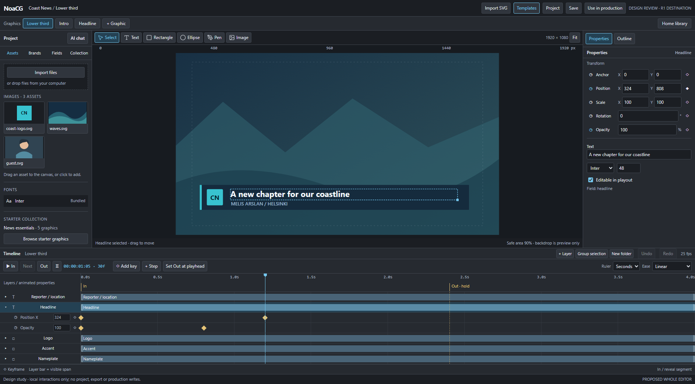

# Editor workflow decisions: assets, layers and multiple graphics

2026-09-19. Owner accepts the overall workspace direction and requests these refinements.
Planning only. EDITOR_PLAN.md owns delivery order; this record explains the new decisions
and their tests. The revised study illustrates controls, not product acceptance.

## 1. Timeline is the main layer list; Properties gets the right dock

Remove the permanently duplicated upper-right Layers list from the default layout. The
timeline already needs hierarchy, stacking, names, selection, visibility, locks, grouping
and creation, so it should own those everyday actions. Selecting a layer or property here
updates the right inspector, and expanded property rows expose values, stopwatches and keys.
There must be no requirement to select the same object again on the right.

Keep an optional **Outline** tab beside Properties for nested SVG inspection: all supported
objects, even when timeline tracks are collapsed/filtered or outside the current span.
It uses the same identities, selection and commands, not another layer store. Offer + Layer,
Group selection, New folder, rename, reorder, hide/lock and reveal-in-timeline there too.
The inspector remains a single dock; switching to Outline temporarily replaces Properties.
This buys canvas/inspector room on laptops and retains a useful imported-artwork navigator.

Timeline header: + Layer menu (Text, Rectangle, Ellipse, Pen shape, Image), Group selection,
New folder and normal selection tools. Context menus expose the same commands. A folder
organizes rows only; a group is a real parent with a transform, parent bar and local ruler.
Group selection is the first answer to 'merge objects so they animate together': preserve
editable children, fields and individual keys. Ungroup preserves the evaluated world pose
and supported animation; refuse an unsupported animated reparent rather than damaging it.
Boolean union, flattening and raster merging are not required for this workflow.

Delivery: R1.0 selection/inspector layout; R1.1a + basic layers; R1.2b full organization/grouping.
Tests B02/B04: select from canvas/timeline/Outline, rename/reorder/lock, group text+shape,
animate parent, retain child field and animation, undo/ungroup/save/reopen/export.

## 2. Reuse the Assets foundation and expose file import clearly

Project Assets has **Import files** and a visible file-drop target. A file chooser and
dropping multiple files from the operating system use one validated import transaction.
Import to Assets does not place everything on the canvas. Drag an asset to the canvas or
timeline to place an instance, with its layer/bar beginning at the playhead/drop time.
Dropping external files directly on the canvas can import and place through that same path.
Import SVG artwork for editable layers continues through the existing wizard; an SVG used
as a simple image asset is a separate explicit choice. Do not silently bypass field mapping.

Existing implementation to reuse: src/components/AssetsPanel.tsx, src/assets/assetUtils.ts,
src/assets/imageImport.ts, src/blocks/assetOps.ts and current canvas placement. AssetsPanel
already includes file/drop import, asset folders, metadata and reference-safe operations.
The current accept list even includes video; preserve existing documents/runtime support,
but new video authoring and a video editing workflow are outside this editor rebuild scope.

R1.2b closes image/font/SVG asset integration, filename collisions, safe rename/delete,
undo, canceled/failed reads and missing-asset reporting. Reuse earlier wherever needed by
R1.1 fixtures. Deduplicate bytes by content identity, preserve relative references, and
bundle every used dependency on export. A user's absolute filesystem path is not an asset ID.

Animated asset support has a bounded sequence: **R2.1a Lottie, R2.1b image sequences**, before
considering video. These formats are explicitly in the destination, not R1.0 prerequisites.
Reuse the bundled Lottie player/support profile; importing JSON alone is not playback support.
For a sequence, group chosen numbered images into one clip with a manifest of ordered asset
IDs, source FPS, dimensions and alpha. Natural numeric order; report missing/mixed frames;
never silently stretch or invent frames. Show frame count/FPS/size before confirming import.
Composition FPS and source FPS may differ. Sample the source frame from absolute clip time
for forward/backward seeks; define half-open trim ranges, loop boundary and final-frame hold.
One asset/clip row, not one timeline layer per image. No CDN or original-folder dependency.

Tests B04/B14: chooser and OS drop produce equivalent assets; duplicate filenames; failed
read rollback; numbered 1/2/10 ordering; mixed/gapped sequence refusal; 24 fps clip in a 25 fps
document; last/first loop frames, reverse seek, interrupted Out and offline exported playback.
Measure decoded-memory and load budgets with real fixtures; refuse over-budget imports clearly.

## 3. A small Pen tool, not an Illustrator rebuild

Add **Pen** beside Text/Rectangle/Ellipse. Click places a corner and straight segment;
click-drag places an anchor with paired tangent handles for a cubic curve. Click the first
point to close, Enter finishes an open path, Escape cancels the current path, Backspace removes
the last draft point. Show the preview path and handles while drawing. Completed paths have
ordinary fill/stroke/width, point/handle adjustment, layer transforms and timeline bars.
Their whole-layer transforms animate; point-by-point path morph animation is out of scope.

R1.2b must at least ship open/closed polygon creation and point movement. Cubic handles belong
to the same bounded tool if the standard geometry adapter passes the fixture, with no new
vector scene model. If curves prove unsuitable, keep the useful polygon tool and record the
specific curve limitation rather than blocking the basic editor. No Boolean operations,
auto-tracing, variable-width brushes, motion paths or Lottie path editing in this slice.

Representation: ordinary readable SVG path data (M/L/C/Z). Draft anchors/handles are transient;
commit emits one source operation and one undo. Evaluate a small native path adapter first.
Paper.js offers existing segment/handle geometry under MIT; it is a candidate only if a
bounded spike shows it simplifies correctness without introducing another persisted scene
or runtime dependency in exports. Pin/review its actual dependency closure if chosen. No
library is installed or selected by this planning review; third-party Studio code policy stands.

Tests B04: triangle, open polyline, curved closed shape if supported, cancel with no document
change, whole-gesture undo, point edit under a transformed SVG parent and export parity.

## 4. AI opens a dock; help precedes edits

The upper-left AI chat button opens a dock alongside the canvas. **R1.3a** delivers grounded
question-answering, selected-document context and an honest unsupported answer. It cannot
mutate the graphic. **R1.3b** enables previewed, bounded changes using the shared operation
registry, expected document/revision, explicit application and normal undo. External source
round-trip remains here; paired live-document MCP stays R3.2. Free assistance needs a bounded
budget and fallback, not a promise of unlimited model use. No account-login adapter is implied.

Tests B17/B18: ask how to add an Out; verify answer against shipped tools; help-only route
cannot write; later editing targets the intended graphic, rejects stale context after a tab
switch, and cannot silently alter production/on-air copies.

## 5. Key selection and easing are shared actions

Replace the earlier five-option cap with **Linear, Easy Ease In, Easy Ease Out, Easy Ease,
Bounce, Overshoot, Hold Keyframe**. Defaults: Bounce settles into the selected key; Overshoot
uses a fixed back-out curve settling into it. Avoid a parameter editor in the first release.
Keep the established key-side rules: In affects approach, Out departure, Easy Ease both,
Hold outgoing. A selected last key with no outgoing segment cannot change a nonexistent one.

Click selects one key; Ctrl/Cmd-click toggles membership; Shift-click also adds/removes, for
Adobe-familiar use. Drag a rectangular marquee ('lasso') across visible property rows to
select keys, with Shift/Ctrl/Cmd adding to the selection. Key dragging and empty-lane selection
are different gestures. Escape cancels a gesture; deleting/moving a batch is one undo.

Toolbar dropdown and key context menu call the same command on the full selection. Right-click
on an already selected key preserves the selection; right-click elsewhere selects that key.
Offer a keyboard context-menu route. Show count/mixed easing; disable unsupported operations
with a reason, and refuse invalid mixed batches atomically instead of partly changing them.
Do not make Ctrl/Cmd-click modifiers the only way to select multiple keys.

R1.2a / B05-B06: marquee/toggle selection across properties/layers, dropdown versus context-menu
parity, unchanged unselected sides, undo/save/reopen/export. Clamp only physically bounded
outputs (for example opacity 0-100%), consistently in inspector/sampler/runtime; Position and
Scale must retain permitted overshoot. Test peaks as well as endpoints and boundary behavior.

Bounce is piecewise, so do not approximate it with the single cubic-bezier string used for
ordinary ease splitting. Extend the shared evaluator gate to named bounce/back functions and
exact mirrored/sliced representations. If a curve cannot yet split exactly, refuse moving
the flag through that segment with a clear reason; never silently substitute Linear or a
rough bezier. This extends G01, including degenerate/equal-endpoint slices and export parity.

## 6. Project is an authoring workspace containing several graphics

A project contains ordered references to independently saved **GraphicDoc** records plus
project metadata and resource references. Each graphic keeps its own SpxTemplate, timeline,
dimensions/FPS, selection/playhead, dirty state, draft, history and AI context. Switch through
a compact graphic tab strip or Project Graphics list in one editor instance. Changing one
graphic never changes another just because it was the previously active store document.

This is not implemented today: src/model/project.ts contains a singleton SavedProject with
one template; templateStore.ts holds one active template/history. src/model/library.ts already
provides durable standalone GraphicDoc IDs, and Home already lists those records. Extend those
seams rather than embedding duplicate templates in a new project file. Productions keep their
existing operational meaning. Do not revive retired Packet/package records or package routes.

Before R1.0, record the multi-document ownership boundary: every registry operation/preview
reply names document ID and revision; a per-document session adapter owns dirty/history/context.
R1.0 need not implement multi-tab persistence. **R1.4a** implements a versioned project manifest
and per-document durable draft recovery through existing storage, with local-first operation.
Existing single-graphic autosaves migrate on read through an adapter, retaining their linked
graphic ID, baseline, dirty edits, fields and AI provenance. Never overwrite the singleton
before the new draft is confirmed. Unknown project versions open read-only; remote sync and
collision behavior must be designed/tested before claiming cross-device project support.

Switching tabs retains pending edits/history; confirmed save status is per graphic. A failed
draft/save write stays visible and offers recovery instead of silently losing work. Save All
reports per-document failures. Closing/removing a project does not delete its library graphics.
One graphic may be referenced by several projects; Duplicate explicitly creates an independent
graphic ID. Removing an asset checks all referencing project members, and exports bundle each
graphic's complete dependency closure independently of the project being open.

## 7. Home and Production use the same saved graphic identities

Finished Save makes a graphic available on Home even before it belongs to a production.
Home adds project filtering/open-project affordances while retaining the standalone Graphics
library, search and bulk selection. Editor and Home share **Add to production**: choose current
graphic or a selected set, choose/create the destination production, preview additions/cue order,
confirm durable installation, then Open production. Those items must already be in its pool
and rundown when playout opens. Saving alone does not silently insert cues into a production.

Productions take deliberate revisioned copies linked by graphicId. Editing the library master
later does not silently update existing rundown instances or on-air content; explicit refresh
uses the existing preview/conflict path. Multiple destinations reuse the same library identities
without name-based accidental merges. Installation retry cannot duplicate pool entries/cues.
Editor Undo affects the current document; durable production installation has its own recovery.

R1.4b applies starter templates/brands to project members; R1.4c closes shared editor/Home
bulk installation and immediate playout availability; R1.4d rehearses recovery/export/host
behavior. B08-B10 remain required. New **B19** closes the independent multi-document journey:
lower third + intro, edit both, switch/undo, reload both drafts, save, find on Home, bulk add
to two rundowns, open playout, edit the master and verify existing/on-air copies stay unchanged.
Include a failed save/install, renamed member, removed project and legacy migration fixture.

## References and distinction from competitor behavior

- [Adobe composition basics](https://helpx.adobe.com/after-effects/desktop/work-with-compositions/composition-settings/composition-basics.html): multiple compositions per project; composition has its own timeline, layer list and time graph. Basis for our project/graphic distinction.
- [Adobe selecting/arranging layers](https://helpx.adobe.com/after-effects/desktop/work-with-layers/select-and-arrange-layers/selecting-arranging-layers.html): shared canvas/timeline selection and timeline stacking. Basis for removing the permanent duplicate list.
- [Adobe keyframe selection](https://helpx.adobe.com/after-effects/desktop/animate-in-after-effects/animation-keyframes/setting-selecting-deleting-keyframes.html): Shift-click/marquee selection. Ctrl/Cmd-toggle is an additional NoaCG shortcut requested by the owner, not a claimed exact Adobe mapping.
- [Adobe drawing shapes](https://helpx.adobe.com/after-effects/desktop/drawing-painting-and-paths/shapes-and-shape-attributes/creating-shapes-masks.html): pen anchors and drag handles. We use a simple shape tool, not Adobe's implicit mask-on-selected-image behavior.
- [Paper.js segments](https://paperjs.org/reference/segment/) and [licence](https://paperjs.org/license/): existing anchor/incoming/outgoing-handle representation and MIT distribution. Candidate for a bounded spike, not permission to copy unrelated code.

These sources guide familiar interaction. Our broadcast hold/reveal/Out and source/runtime
contracts remain authoritative. No claim of full Adobe or Studio parity follows from this review.

## Revised study and honest limits

Open `editor-workflow-review-preview.html` locally. The fragment is `editor-workflow-review.html`.
Try the graphic tabs, Properties/Outline, Import files/drop, Pen (Enter or close at first point),
Ctrl/Cmd-click keys, drag a selection box and apply easing from the toolbar or right-click menu.
Home library and Use in production illustrate the shared destination picker.

The study retains three independent graphic edits/history stacks in memory only. Reload loses
them. File import demonstrates selection/drop receipts without reading file bytes. Grouping
illustrates row organization, not parent-transform composition. Folders are an explanatory
dialog. AI is a planned dock, not a connected chatbot. Home is representative, not the shipped
Home page; production writes are disabled. Pen paths and local easing preview are disposable
study code, not production geometry/easing adapters. Exact key-side curves, group transforms,
path-node editing, persistence, runtime parity and keyboard completeness require their named
product tests. Earlier whole-workspace study limitations still apply where unchanged.

Inspect 1920/1366 desktop screenshots and narrow review layouts; no professional mobile editor
is promised. Browser checks cover the demonstrated interactions, not the acceptance ledger.

Verification: queue job `j-1388` passed 37 mockup checks with no script errors, including
independent tab edits/undo, direct timeline values, Pen curves, multi-key easing, and carrying
Home's selected subset into production review. Dark desktop and context-menu screenshots
were visually inspected. Build job `j-1385` passed the repository gate. These receipts verify
the planning branch and study only; the product acceptance tasks remain unverified.
