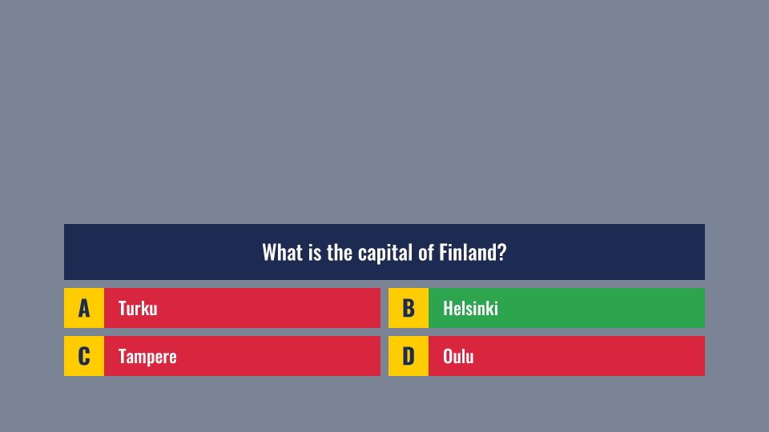
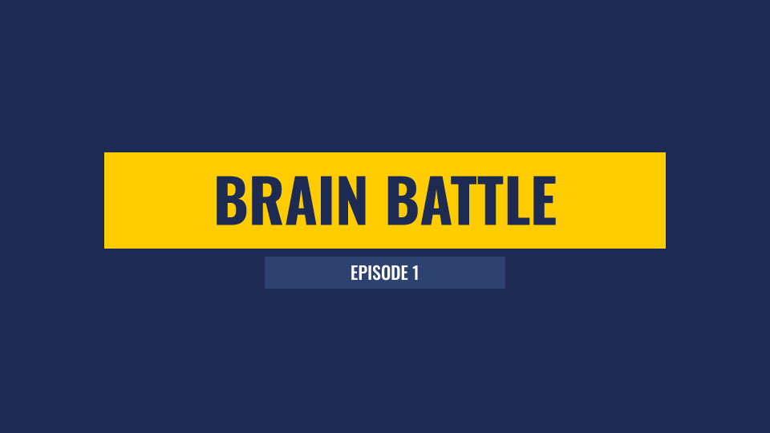
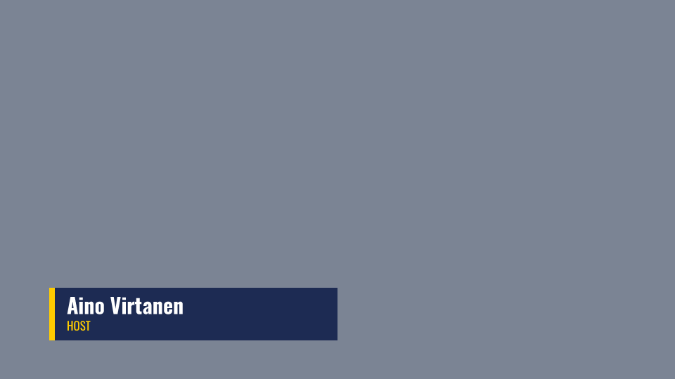
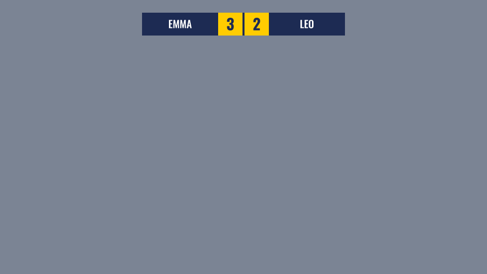
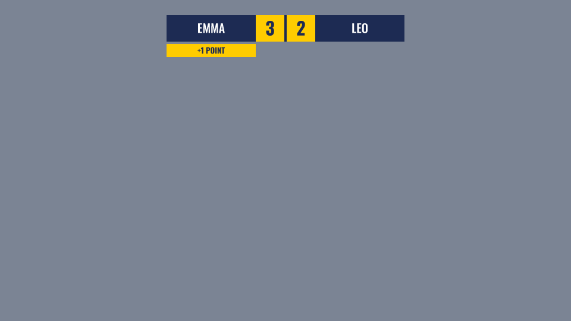
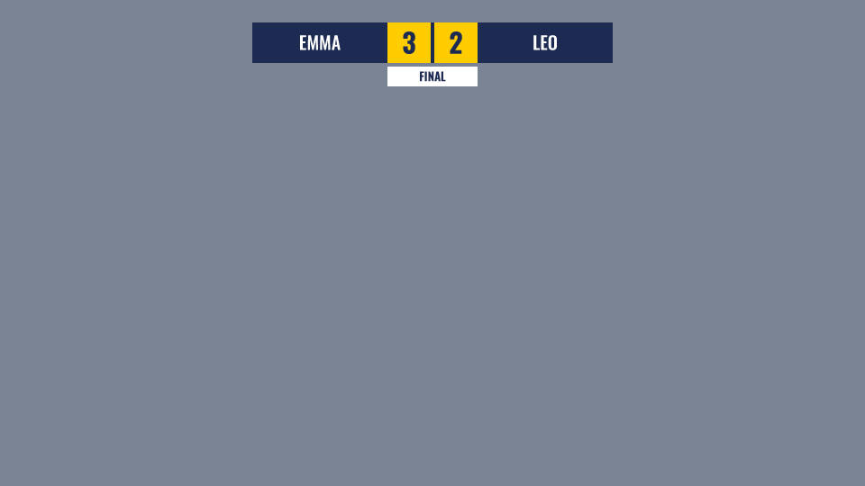
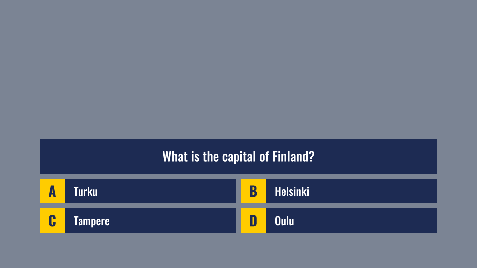
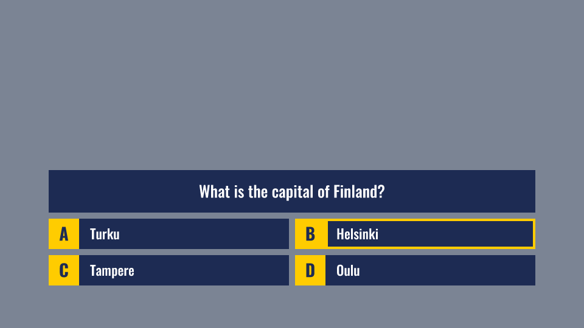
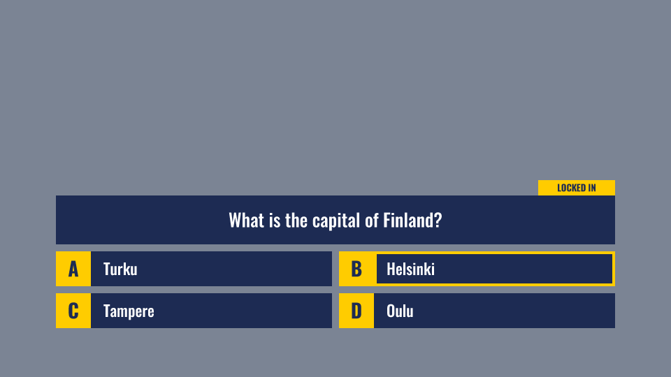
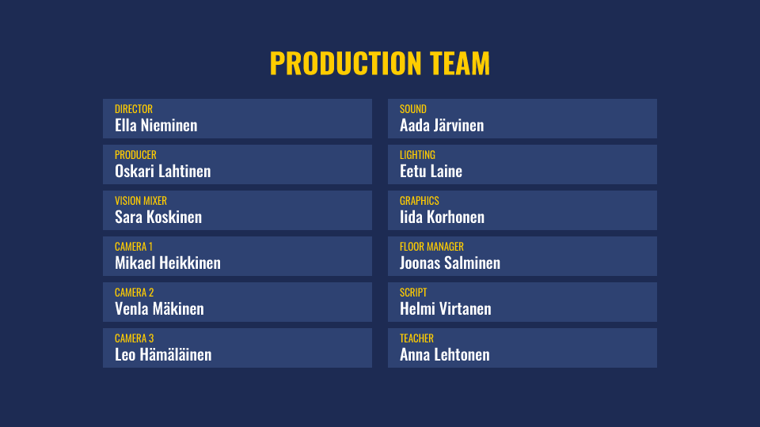

# Brain Battle: an example graphics set

Five graphics for a 50-minute talk show with a quiz. One host, two contestants, a score between
them, and a quiz question with four answers. Everything is drawn from plain rectangles and one
font, on purpose: you can build every file in this folder yourself in a lesson.

Use the set to walk the whole road once:

**Illustrator** (draw and name the layers) **> Save a Copy as SVG > NoaCG Import > edit the
fields > playout.**



## What is in the folder

| Folder | What it holds |
|---|---|
| `illustrator/` | The five source files. Open them in Illustrator and look at the Layers panel. |
| `import-ready/` | The SVG that Illustrator's **Save a Copy** writes from each `.ai` file. Drop these into NoaCG. |
| `preview/` | A picture of each graphic, and of each state the scoreboard and the quiz can be in. |

| Graphic | Files | What the operator changes |
|---|---|---|
| Title | `title` | Show name, Subtitle |
| Lower third | `lower-third` | Name, Role. One graphic for the host and both guests. |
| Scoreboard | `scoreboard` | Team 1, Score 1, Team 2, Score 2, plus +1 and -1 buttons |
| Quiz | `quiz` | Question, Answer A to D, the correct answer, and Select, Lock and Reveal buttons |
| End credits | `end-credits` | Heading, and twelve pairs of Role and Person |

**Font.** Everything uses **Oswald** (Regular, Medium and Bold). It is free on Google Fonts and
Adobe Fonts, and NoaCG carries it too, so the graphic looks the same on every machine. If
Illustrator opens a file with pink highlighted text, Oswald is not installed: activate it in the
Creative Cloud app under Fonts, or install it from fonts.google.com.

## The rule every file follows

**Three layers, always in this order from the top of the Layers panel:**

- **Text** holds what the operator types. One text object per field, named for what it is:
  `Question`, `Team 1`, `Name`.
- **Moments** holds what NoaCG switches on and off during the show. Each moment is a **group**
  with its eye icon turned **off**: `Selected A`, `Flash 1`, `Full time`.
- **Board** holds everything that stays as you drew it: backgrounds, boxes, fixed labels.

A graphic with nothing to switch on and off (the title, the lower third, the credits) has only
Text and Board.

**A name is a word and a row, the row last, after a space.** `Answer A`, `Selected A`, `Score 1`,
`Role 12`. Layers with the same row belong together, so `Answer B`, `Selected B`, `Correct B` and
`Wrong B` are all about answer B. The quiz counts in letters because the letters are on the
board. Everything else counts in numbers.

**Fixed text starts with `static:`.** The A, B, C and D on the quiz are text you typed, but the
operator must never change them, so they are called `static:Letter A` and live in Board.

**Name every text object.** Double-click its row in the Layers panel and type the name. The name
is the label the operator reads on the control page. A text object nobody named shows up as its
own words, which tells the operator nothing.

**Use point type.** Click once with the Type tool and type. Do not drag a text box, and never use
Type > Create Outlines on text the operator should change.

## The five files, layer by layer

The trees below are what the Layers panel shows. Illustrator lists the top object first, and
NoaCG lists the fields in the opposite order, bottom first, so `Question` sits at the bottom of
Text and is the first field on the control page.

### Title (`title.ai`)



```
Text
  Subtitle          "EPISODE 1"
  Show name         "BRAIN BATTLE"
Board
  Subtitle box
  Title box
  Background
```

The text is centred in its box. NoaCG notices that, so a longer show name widens the yellow box
from the middle.

### Lower third (`lower-third.ai`)



```
Text
  Role              "HOST"
  Name              "Aino Virtanen"
Board
  Accent
  Panel
```

One graphic for all three people. Type the host's name and role, take it, then type the next
guest and press Update. A long name makes the panel wider.

### Scoreboard (`scoreboard.ai`)



```
Text
  Score 2           "2"
  Team 2            "LEO"
  Score 1           "3"
  Team 1            "EMMA"
Moments
  Full time         (hidden)   a white FINAL tab
  Flash 2           (hidden)   a yellow +1 POINT tab under Leo
  Flash 1           (hidden)   a yellow +1 POINT tab under Emma
Board
  Score box 2
  Score box 1
  Middle
  Team box 2
  Team box 1
```

The scores must be plain numbers (`3`, not `3 pts`), because a +1 button can only count a number.
NoaCG recognises the names and makes this a **score tracker** by itself.

| Normal | Emma scores (+1) | Full time |
|---|---|---|
|  |  |  |

### Quiz (`quiz.ai`)



```
Text
  Answer D          "Oulu"
  Answer C          "Tampere"
  Answer B          "Helsinki"
  Answer A          "Turku"
  Question          "What is the capital of Finland?"
Moments
  Wrong D           (hidden)   red row
  Correct D         (hidden)   green row
  Selected D        (hidden)   yellow frame
  ... the same three for C, B and A ...
  Locked in         (hidden)   a yellow LOCKED IN tab
Board
  static:Letter D ... static:Letter A
  Letter box D ... Letter box A
  Row D ... Row A
  Question box
```

The quiz sits in the lower half of the screen, so the contestants stay visible above it. NoaCG
recognises the names and makes this a **quiz** by itself, with every moment already connected.

The moments are drawn **only over the answer row**, not over the letter box, so the letter stays
readable in every state. Text is the top layer, so the answers stay on top of the colours.

| Question | Answer selected | Locked in | Reveal |
|---|---|---|---|
|  |  |  |  |

On the reveal NoaCG paints the correct answer green and every other answer red, and takes the
LOCKED IN tab down.

### End credits (`end-credits.ai`)



```
Text
  Person 12         "Anna Lehtonen"
  Role 12           "TEACHER"
  ...
  Person 1          "Ella Nieminen"
  Role 1            "DIRECTOR"
  Heading           "PRODUCTION TEAM"
Board
  Credit box 12 ... Credit box 1
  Background
```

Twelve boxes, 1 to 6 down the left column and 7 to 12 down the right. Every role and every name
is a field, so the whole team is typed in NoaCG and nothing has to be redrawn. On the control
page each Role sits beside its Person on one row. A smaller crew leaves the spare fields empty,
or delete the spare boxes and text objects in Illustrator before exporting.

## Step 1. Look at it in Illustrator

Open a file from `illustrator/` and open the Layers panel (Window > Layers). Expand Text, Moments
and Board. Click the eye next to a moment, `Correct B` for example, to see that look, then click
it off again. **Every moment must be hidden when you save.**

## Step 2. Save the SVG

This is the step that most often goes wrong. Use **File > Save a Copy**, not Export As. Export As
leaves hidden layers out of the file, so the quiz would arrive with no moments at all.

1. File > Save a Copy. Format: **SVG (svg)**. Tick **Use Artboards**. Save.
2. In the SVG Options dialog:

| Setting | Value |
|---|---|
| SVG Profiles | SVG 1.1 |
| Fonts, Type | SVG |
| Fonts, Subsetting | None (Use System Fonts) |
| Image Location | Embed |
| Preserve Illustrator Editing Capabilities | off |
| More Options > CSS Properties | Style Elements |

The files in `import-ready/` were saved exactly this way from the files in `illustrator/`. Your
own export should look the same.

## Step 3. Import into NoaCG

1. Open NoaCG and choose **New graphic > Import graphic**.
2. Drop the SVG on the drop zone and press **Next**.
3. The **Fields** step lists the text objects by their layer names, already ticked. The quiz
   letters are unticked, because they are `static:`. For the quiz and the scoreboard, **What it
   does** is already filled in. Check it and press **Next**.
4. Pick an in and out animation and press **Next**.
5. On **Finish**, the name comes from the file name. Under Production choose **New production**
   and call it **Brain Battle** the first time. For the other four files, pick Brain Battle from
   the list. Press **Add to the production and go live**, then **Add it and go there**.

After all five, the Brain Battle rundown has five cues, each on its own playout layer, so the
scoreboard can stay on air while a lower third comes and goes.

## Step 4. Run the show

On the production's Playout page, click a cue in the rundown, change its fields, and press
**Take**. To change a graphic that is already on air, edit the field and press **Update**.
**Take off** removes it.

A rehearsal running order:

1. **Title.** Take it. Take it off.
2. **Lower third.** Host name and role, Take. Change to the first guest, Update. Then the second
   guest, Update. Take off.
3. **Scoreboard.** Type both contestants' names, set the scores to 0, Take. Leave it on air.
4. **Quiz.** Type the question and the four answers, and pick the **Correct answer**. Take.
   - A contestant answers: pick that letter under **Selected answer**, press **Select answer**.
   - Press **Lock it in**.
   - Press **Reveal correct**.
   - On the scoreboard cue, press **+1** for the contestant who got it right.
   - Take the quiz off, type the next question, Take again.
5. **Scoreboard.** At the end press **Full time**. Take off.
6. **End credits.** Type the team, Take, Take off.

All of this works in the Playout page's own Preview and Program monitors with no account. To
send the graphics to a real output, press **Start production** (it needs a free NoaCG account)
and add the output URL it gives you as a browser source in OBS or vMix, or load it in CasparCG.

## Make your own

Copy one of the files and change the look: colours, sizes and positions are yours. Keep three
things: the layer names, the order of the three layers, and the moments hidden when you save.
Then run Steps 2 to 4 again and your design goes on air the same way.

The full list of names NoaCG reads, with the synonyms and Finnish words it also accepts, is on
the NoaCG docs page under **Layer names**.
