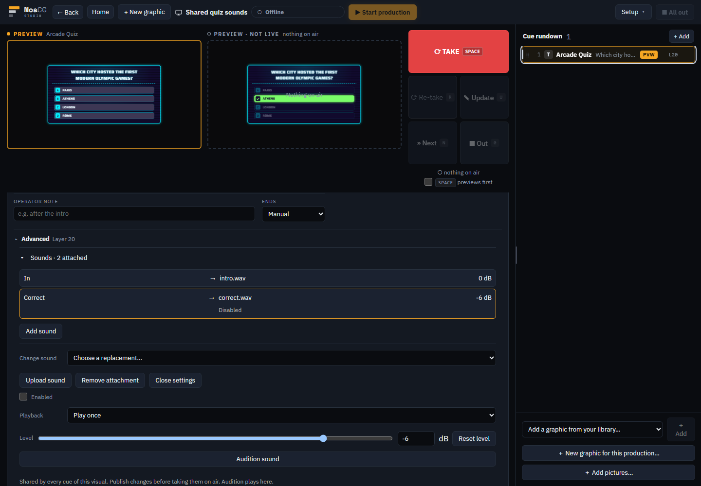

# Shared production sounds: verification

2026-10-04. Branch `codex/playout-shared-sounds`, review base `a3bb906fe01a305afbbdeed58dc275159f033ae7`.

## Phase proofs

Playback was verified before the secondary controls. Production publication and prepared assets require the same resolver/runtime contract, so this production extension lands atomically. The earlier graphic playback and editor controls landed in PRs #695 and #697.

`npx playwright test e2e/production-sounds.spec.ts --project=chromium --workers=1` (queued job j-3311): **6 passed**. Uses actual Chromium AudioContext decoding and AudioBufferSourceNode starts in sandboxed receiving frames. Independent generated WAV fixtures, no health-session helpers changed. The complete authoring walk reports zero console/page errors and zero failed requests.

| Acceptance | Evidence |
|---|---|
| AC-1 | PNG independent In/Out, linear Next, accepted quiz Selection/Correct/Wrong, duplicate/refused presses silent. Switching to an unconfigured image is silent. Live fetch throws after preparation without affecting playback. |
| AC-2 | Native game-timer pause/resume/reset/expiry, repeated presses, context suspension/recovery, single restored loop, 50 ms fades, Out tail, clearing and disposal. Existing graphic-sound spec covers authored timer/warning transitions and parallel groups. |
| AC-3 | 200 cues serialize identically with and without sounds. Production pack copy preserves independent bindings; byte assets deduplicate by SHA-256. |
| AC-4 | Durable reload, pack export/import, shared assets, private cloud externalization without audio bytes in rows, publication payload and single-file quiz/PNG exports decoded in Chromium. Transport storage keys do not change emitted graphic content. Actual hosted round trip remains unverified until the migration lands. |
| AC-5 | Corrupt cache is rejected, missing Storage makes preparation fail visibly, retry repairs it, visual Take remains immediate and its missed In is never replayed. A stalled request expires and retry creates a fresh download, without a late In. A cold, already-running countdown restores exactly one loop when preparation completes. Valid hash plus invalid WAV bytes fails decoding. Sound memory budget tests count separate decoded copies and release them. |
| AC-6/7 | Quiz controls and answers remain above Sounds and operational. Collapsed count includes disabled attachments. Upload/reuse/swap back and forth, negative numerical dB entry, silent PROGRAM monitor and reload tested at desktop and narrow widths. Rendered screenshots inspected below. |
| AC-8 | Physical receiving hosts remain unverified. Local vMix service exists but its API is unavailable; no active OBS/CasparCG host was found. No venue recording or measured routing/skew claim is made. |

[Collapsed view](built/quiz-collapsed.png), [narrow view](built/quiz-narrow.png).

`node --test scripts/production-sound.test.mjs scripts/asset-refusal.test.mjs scripts/e2e-affected.test.mjs`: **70 passed**. SHA-256 checked against Node crypto across padding and large-file boundaries; topology timing changes remain safe while renamed triggers require rebinding; unchanged resolver results retain identity; dB and audio readiness fields remain valid.

Catalog source baseline regenerated for the intended shared runtime change: 528 JavaScript fingerprints changed, zero HTML/CSS fingerprints changed. Rendered baseline was not rerecorded. Final catalog checks pass: type floor (526 variants, j-3312), overflow against baseline (j-3313), field coverage (526 variants, j-3314), and catalog structural/baseline specs (35 + four tests, j-3316).

## Readiness and deployment limits

- WAV, MP3, OGG and M4A remain subject to actual receiving-browser decoding. Limits: 20 MiB encoded and 64 MiB decoded per sound, warning at 128 MiB decoded per output, refusal above 512 MiB. No normalization or transcoding.
- Prepared sounds play without Storage/database reads. Hosted command delivery retains the existing backend transport. Resume/recovery restarts eligible loops from the beginning, never historical one-shots.
- Private asset storage retains its existing account ownership. A team member on a fresh machine needs the assets available locally or a production pack to republish another member's private uploads. This change does not expand private-bucket read access.
- Custom sound code is preserved and requires review before production attachments can overlay it. Trigger identity/order/meaning changes require removal and rebinding.
- Migration 0076 is additive and service-only. `npm run db:push -- --dry-run --json` classified all 10 statements without findings. Production currently has a renderer heartbeat, so its live-path migration is held for a quiet window. No pre-landing database changes were made.
- The dedicated `/api/output/assets` function authorizes only the current published version's hashes and database-derived uploader folder. It raises the explicit Pro deployment function budget from 12 to 13; data-ingress credentials gain no asset access. Handler authorization and failure cases are exercised by the API test suite.

`npm run build`: exit 0, **2,437 passed, three deliberate skips**, type checks, lint, dependency graph, bundle and documentation/security gates. `node scripts/run-ai-gateway-tests.mjs`: **321 passed**. `git diff --check`: passed.

Inline review fixed stale resolver identities that could reload previews, accepted duplicate verdict sounds, audio errors being retained as visual failures, stale async saves, negative numerical level entry, corrupt/cache-unavailable handling, account-adoption rollback isolation, stale replacement selections, stalled preparation retries and cold loop restoration after decoding. Private audio objects use the existing flat account folder so storage-usage accounting includes them. Simplification reused the strict animation literal locator and existing binary asset utilities, keeping packaging independent of backend services. Frozen legacy runtime body was compared byte-for-byte with the landed helper and is used only for safe upgrade recognition.

Broader regression results are recorded after their final runs. Physical rehearsal follows the [receiving-host checklist](../../acceptance/owner-queue/graphic-sound-host-rehearsal.md).
